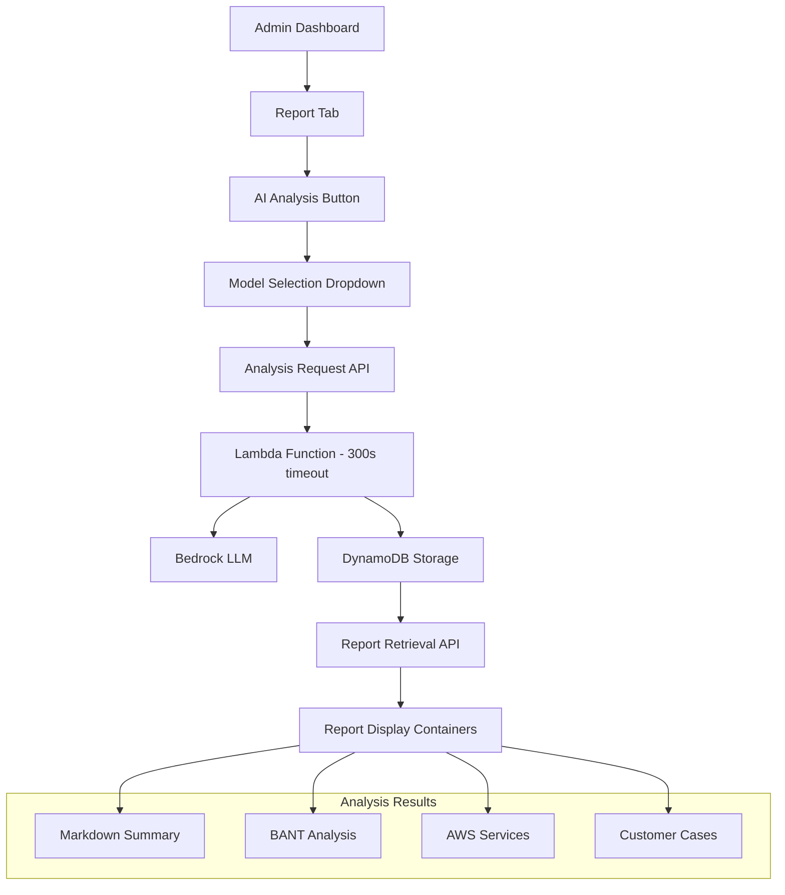

# Design Document

## Overview

The AI Report redesign transforms the current multi-step agent-based reporting system into a streamlined direct LLM analysis approach. The new system eliminates the complex prompt generation and agent selection workflow, replacing it with a simple "AI Analysis" button that directly processes conversation data and stores structured results in DynamoDB.

Key changes:
- Remove 4-step wizard interface (analysis options → prompt generation → agent selection → results)
- Replace with single "AI Analysis" button with model selection
- Store structured analysis results in DynamoDB instead of generating markdown reports
- Display results in separate containers for each analysis type
- Support long-running Lambda operations (up to 300 seconds)

## Architecture

### High-Level Architecture



### Data Flow

1. **Analysis Request**: User clicks "AI Analysis" → selects LLM model → triggers analysis
2. **Processing**: Lambda function processes conversation with selected LLM (up to 300s)
3. **Storage**: Structured results stored in DynamoDB mte-sessions table
4. **Retrieval**: Client calls report API to fetch stored analysis
5. **Display**: Results rendered in separate containers

## Components and Interfaces

### Backend Components

#### 1. Analysis Handler (`admin_handler.py`)

**New Function: `analyze_conversation`**
```python
def analyze_conversation(event, context):
    """
    Analyze conversation using selected LLM model and store structured results
    - Timeout: 300 seconds
    - Processes conversation history with LLM
    - Stores 4 analysis components in DynamoDB
    """
```

**Modified Function: `get_session_report`**
```python
def get_session_report(event, context):
    """
    Retrieve stored analysis results from DynamoDB
    - Returns structured analysis data
    - No longer generates reports on-demand
    """
```

**Functions to Remove:**
- `generate_optimized_prompt`
- `generate_report_with_model` 
- `generate_report_with_agent`

#### 2. Infrastructure Updates (`template.yaml`)

**Lambda Configuration:**
```yaml
AnalyzeConversationFunction:
  Type: AWS::Serverless::Function
  Properties:
    Timeout: 300  # 5 minutes
    MemorySize: 1024
```

**API Gateway Configuration:**
```yaml
Events:
  AnalyzeConversation:
    Type: Api
    Properties:
      TimeoutInMillis: 300000  # 5 minutes
```

### Frontend Components

#### 1. Simplified Report Interface

**Replace `ReportGenerator.tsx` with `AIAnalysisReport.tsx`:**

```typescript
interface AIAnalysisReportProps {
  sessionId: string
}

interface AnalysisResults {
  markdownSummary: string
  bantAnalysis: {
    budget: string
    authority: string
    need: string
    timeline: string
  }
  awsServices: Array<{
    service: string
    reason: string
    implementation: string
  }>
  customerCases: Array<{
    title: string
    description: string
    relevance: string
  }>
  analyzedAt: string
  modelUsed: string
}
```

#### 2. Analysis Request Interface

**Simple Model Selection:**
```typescript
interface AnalysisRequest {
  sessionId: string
  modelId: string
}
```

#### 3. Report Display Containers

**Four Separate Containers:**
1. **Summary Container**: Renders markdown summary
2. **BANT Container**: Structured BANT display
3. **AWS Services Container**: Service recommendations grid
4. **Customer Cases Container**: Case study cards

## Data Models

### DynamoDB Schema Updates

**mte-sessions Table - New Attributes:**

```json
{
  "PK": "SESSION#{sessionId}",
  "SK": "METADATA",
  // ... existing attributes
  "aiAnalysis": {
    "markdownSummary": "string",
    "bantAnalysis": {
      "budget": "string",
      "authority": "string", 
      "need": "string",
      "timeline": "string"
    },
    "awsServices": [
      {
        "service": "string",
        "reason": "string",
        "implementation": "string"
      }
    ],
    "customerCases": [
      {
        "title": "string",
        "description": "string",
        "relevance": "string"
      }
    ],
    "analyzedAt": "ISO8601 timestamp",
    "modelUsed": "string"
  }
}
```

### LLM Analysis Prompt

**Structured Analysis Prompt:**
```
고객 상담 내용을 분석하여 다음 4가지 항목을 JSON 형태로 제공해주세요:

고객 정보:
- 이름: {customerName}
- 회사: {customerCompany}
- 직책: {customerTitle}

대화 내용:
{conversationHistory}

다음 형식으로 분석 결과를 제공해주세요:

{
  "markdownSummary": "meet-logs-md.md 파일의 템플릿 구조를 참고하여 작성된 마크다운 요약 (Account Info, Meeting Logs, Account Planning 섹션 포함)",
  "bantAnalysis": {
    "budget": "예산 관련 분석",
    "authority": "의사결정권한 분석", 
    "need": "필요성 분석",
    "timeline": "일정 분석"
  },
  "awsServices": [
    {
      "service": "서비스명",
      "reason": "추천 이유",
      "implementation": "구현 방안"
    }
  ],
  "customerCases": [
    {
      "title": "사례 제목",
      "description": "사례 설명",
      "relevance": "관련성"
    }
  ]
}
```

**Markdown Summary Template Reference:**
The `markdownSummary` should follow the structure defined in `meet-logs-md.md`:

1. **Account Info Section**: Company details, industry, business model, key requirements, challenges, budget, etc.
2. **Meeting Logs Section**: Meeting minutes with key discussion points and follow-up items
3. **Account Planning Section**: Strategic planning notes and next steps

This template provides a standardized format that AWS sales representatives are familiar with for customer meeting documentation.

## Error Handling

### Timeout Management

1. **Lambda Timeout (300s)**:
   - Graceful degradation if analysis takes too long
   - Partial results storage if possible
   - Clear error messaging to user

2. **API Gateway Timeout**:
   - Configure 300s integration timeout
   - Handle timeout responses appropriately

3. **Client-Side Timeout**:
   - 300s maximum wait time
   - Loading indicators with progress
   - Retry mechanisms

### Error Scenarios

1. **LLM Analysis Failure**:
   - Retry with different model
   - Fallback to basic summary
   - Clear error messages

2. **DynamoDB Storage Failure**:
   - Retry storage operations
   - Log errors for debugging
   - User notification

3. **Invalid Session Data**:
   - Validate conversation history
   - Handle empty conversations
   - Appropriate error responses

## Testing Strategy

### Unit Tests

1. **Backend Functions**:
   - `analyze_conversation` function
   - LLM prompt generation
   - DynamoDB storage operations
   - Error handling scenarios

2. **Frontend Components**:
   - `AIAnalysisReport` component
   - Model selection interface
   - Result display containers
   - Loading states and error handling

### Integration Tests

1. **End-to-End Analysis Flow**:
   - Request analysis → process → store → retrieve → display
   - Different LLM models
   - Various conversation lengths

2. **Timeout Scenarios**:
   - Long-running analysis operations
   - Network timeout handling
   - Graceful degradation

### Performance Tests

1. **Lambda Performance**:
   - Analysis processing time
   - Memory usage optimization
   - Concurrent request handling

2. **DynamoDB Performance**:
   - Storage operation latency
   - Read/write capacity planning
   - Query optimization

## Migration Strategy

### Phase 1: Backend Implementation
1. Implement new `analyze_conversation` function
2. Update DynamoDB schema
3. Modify `get_session_report` function
4. Update infrastructure configuration

### Phase 2: Frontend Implementation  
1. Create new `AIAnalysisReport` component
2. Replace existing `ReportGenerator`
3. Update API service calls
4. Implement new UI containers

### Phase 3: Cleanup
1. Remove legacy report generation functions
2. Clean up unused API endpoints
3. Remove agent-based reporting code
4. Update documentation

### Rollback Plan
- Keep legacy functions during transition
- Feature flag for new vs old interface
- Database schema backward compatibility
- Gradual user migration

## Security Considerations

1. **API Security**:
   - Maintain existing authentication
   - Rate limiting for analysis requests
   - Input validation and sanitization

2. **Data Privacy**:
   - Secure storage of analysis results
   - Proper data retention policies
   - Access control for sensitive data

3. **LLM Security**:
   - Prompt injection prevention
   - Output sanitization
   - Model access controls

## Performance Optimization

1. **Lambda Optimization**:
   - Appropriate memory allocation
   - Connection pooling for DynamoDB
   - Efficient JSON parsing

2. **Frontend Optimization**:
   - Lazy loading of analysis results
   - Caching of retrieved data
   - Optimistic UI updates

3. **Database Optimization**:
   - Efficient data structure design
   - Minimal read/write operations
   - Proper indexing strategy