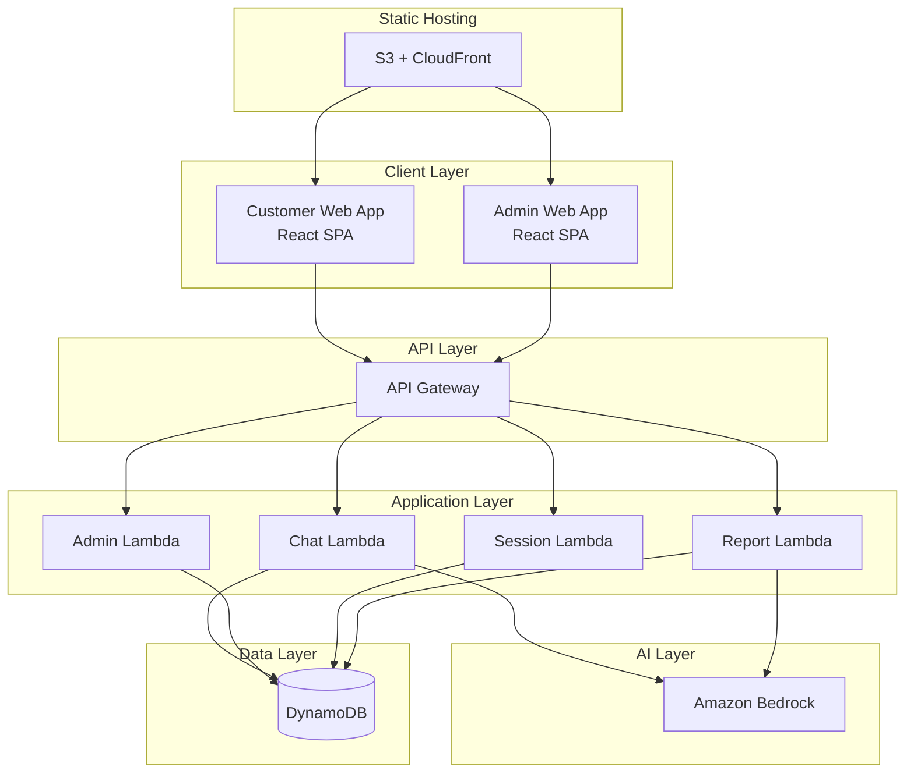

# Design Document

## Overview

The MTE Pre-consultation Chatbot is a serverless web application that facilitates structured conversations between AWS customers and an AI-powered chatbot to collect business requirements before sales meetings. The system consists of two main interfaces: a customer-facing chatbot interface and an admin interface for AWS sales representatives. The architecture leverages AWS serverless services including API Gateway, Lambda, DynamoDB, and Amazon Bedrock for AI capabilities.

## Architecture

### High-Level Architecture



### Technology Stack

**Frontend:**
- Node.js v20.18.1 with Yarn 1.22.22
- React 18+ for SPA development
- AWS Cloudscape Design System components
- TypeScript for type safety
- React Router for navigation
- Axios for API communication

**Backend:**
- AWS API Gateway for REST API endpoints
- AWS Lambda (Node.js 20.x runtime) for serverless functions
- Amazon DynamoDB for data persistence
- Amazon Bedrock (Claude 3 or similar) for conversational AI
- AWS CloudWatch for logging and monitoring

**Infrastructure:**
- AWS S3 + CloudFront for static web hosting
- AWS IAM for security and access control
- AWS Systems Manager Parameter Store for configuration

## Components and Interfaces

### Frontend Components

#### Customer Interface Components

**ChatInterface**
- Main conversation component with message history
- Input field for customer responses
- Typing indicators and loading states
- Progress indicator showing conversation stage
- Cloudscape Chat UI components

**ConversationFlow**
- State management for 5-stage conversation flow
- Dynamic question generation based on customer responses
- Context preservation across conversation stages
- Adaptive questioning based on technical level detection

**SessionManager**
- URL parameter parsing for session ID
- Session validation and error handling
- Connection state management with backend
- Automatic session cleanup on completion

#### Admin Interface Components

**SessionDashboard**
- Table view of all pre-consultation sessions
- Filtering and sorting capabilities
- Status indicators (active, completed, closed)
- Quick actions for session management

**SessionDetails**
- Complete Q&A transcript display organized by stages
- Customer information and session metadata
- Action buttons for session closure/archival

**ReportViewer**
- Markdown rendering for 1-page summaries
- AWS documentation recommendations display
- Export capabilities for reports

**SessionCreator**
- Form for creating new pre-consultation sessions
- Customer contact information input
- Authority target specification
- URL generation and sharing

### Backend API Endpoints

#### Chat API (`/api/chat`)

**POST /api/chat/message**
```typescript
interface ChatMessageRequest {
  sessionId: string;
  message: string;
  messageId: string;
}

interface ChatMessageResponse {
  response: string;
  stage: ConversationStage;
  isComplete: boolean;
  nextQuestions?: string[];
  salesRepInfo?: SalesRepresentative;
}
```

**GET /api/chat/session/{sessionId}**
```typescript
interface SessionResponse {
  sessionId: string;
  status: 'active' | 'completed' | 'expired';
  currentStage: ConversationStage;
  conversationHistory: Message[];
  customerInfo: CustomerInfo;
}
```

#### Admin API (`/api/admin`)

**POST /api/admin/sessions**
```typescript
interface CreateSessionRequest {
  customerName: string;
  customerEmail: string;
  customerCompany: string;
  targetAuthority: string;
  salesRepId: string;
  expirationDate?: string;
}

interface CreateSessionResponse {
  sessionId: string;
  sessionUrl: string;
  expirationDate: string;
}
```

**GET /api/admin/sessions**
```typescript
interface SessionListResponse {
  sessions: SessionSummary[];
  pagination: PaginationInfo;
}
```

**GET /api/admin/sessions/{sessionId}/report**
```typescript
interface SessionReportResponse {
  sessionId: string;
  summary: string; // Markdown formatted
  qnaTranscript: ConversationStage[];
  awsDocumentation: DocumentationRecommendation[];
  customerProfile: CustomerProfile;
}
```

## Data Models

### DynamoDB Table Design

#### Sessions Table
```typescript
interface SessionRecord {
  PK: string; // SESSION#{sessionId}
  SK: string; // METADATA
  sessionId: string;
  status: 'active' | 'completed' | 'closed' | 'expired';
  customerInfo: {
    name: string;
    email: string;
    company: string;
    targetAuthority: string;
  };
  salesRepId: string;
  createdAt: string;
  expirationDate: string;
  completedAt?: string;
  currentStage: ConversationStage;
  GSI1PK: string; // SALESREP#{salesRepId}
  GSI1SK: string; // SESSION#{createdAt}
}
```

#### Conversation Messages Table
```typescript
interface MessageRecord {
  PK: string; // SESSION#{sessionId}
  SK: string; // MESSAGE#{timestamp}#{messageId}
  sessionId: string;
  messageId: string;
  timestamp: string;
  sender: 'customer' | 'bot';
  content: string;
  stage: ConversationStage;
  metadata?: {
    technicalLevel?: 'beginner' | 'intermediate' | 'advanced';
    extractedInfo?: ExtractedInformation;
  };
}
```

#### Session Analysis Table
```typescript
interface AnalysisRecord {
  PK: string; // SESSION#{sessionId}
  SK: string; // ANALYSIS
  sessionId: string;
  summary: string; // AI-generated markdown summary
  extractedRequirements: {
    authority: AuthorityInfo;
    business: BusinessInfo;
    awsServices: AWSServiceInterest[];
    technical: TechnicalRequirements;
    timeline: TimelineInfo;
  };
  awsDocumentationRecommendations: DocumentationRecommendation[];
  generatedAt: string;
}
```

### TypeScript Interfaces

```typescript
enum ConversationStage {
  AUTHORITY = 'authority',
  BUSINESS = 'business', 
  AWS_SERVICES = 'aws_services',
  TECHNICAL = 'technical',
  NEXT_STEPS = 'next_steps',
  COMPLETED = 'completed'
}

interface AuthorityInfo {
  role: string;
  decisionMakers: string[];
  budgetApprover: string;
  technicalDecisionMaker: string;
}

interface BusinessInfo {
  industry: string;
  mainServices: string[];
  businessProblems: string[];
  awsGoals: string[];
  itChallenges: string[];
  expansionPlans?: string;
}

interface TechnicalRequirements {
  currentTechStack: string[];
  expectedUsers: number;
  trafficScale: string;
  availabilityRequirements: string;
  backupRequirements: string;
  performanceRequirements: string[];
  complianceRequirements: string[];
}

interface TimelineInfo {
  projectDeadline: string;
  meetingPreference: string;
  pocInterest: boolean;
  budgetApprovalTimeline: string;
  additionalParticipants: string[];
}
```

## Error Handling

### Frontend Error Handling

**Network Errors**
- Implement retry logic with exponential backoff
- Display user-friendly error messages
- Maintain conversation state during temporary failures
- Provide offline indicators when appropriate

**Session Errors**
- Handle expired or invalid session URLs gracefully
- Redirect to appropriate error pages with clear messaging
- Provide contact information for manual assistance

**Validation Errors**
- Real-time input validation with clear feedback
- Prevent submission of incomplete required fields
- Guide users to correct input format issues

### Backend Error Handling

**Lambda Function Errors**
- Structured error responses with appropriate HTTP status codes
- Comprehensive logging for debugging and monitoring
- Graceful degradation when external services are unavailable

**DynamoDB Errors**
- Retry logic for throttling and temporary failures
- Proper handling of conditional write failures
- Data consistency checks and recovery procedures

**Bedrock API Errors**
- Fallback responses when AI service is unavailable
- Rate limiting and quota management
- Content filtering and safety checks

## Testing Strategy

### Unit Testing

**Frontend Testing**
- Jest and React Testing Library for component testing
- Mock API responses for isolated component testing
- Test conversation flow state management
- Validate Cloudscape component integration

**Backend Testing**
- Jest for Lambda function unit tests
- Mock AWS SDK calls for isolated testing
- Test conversation logic and stage transitions
- Validate data transformation and storage operations

### Integration Testing

**API Integration**
- Test complete request/response cycles
- Validate data persistence in DynamoDB
- Test Bedrock integration with sample conversations
- Verify error handling across service boundaries

**End-to-End Testing**
- Cypress for full user journey testing
- Test complete conversation flows from start to finish
- Validate admin interface functionality
- Test session lifecycle management

### Performance Testing

**Load Testing**
- Simulate concurrent user conversations
- Test DynamoDB read/write capacity scaling
- Validate Lambda cold start performance
- Monitor Bedrock API response times

**Scalability Testing**
- Test auto-scaling behavior under load
- Validate cost optimization at scale
- Test data retention and cleanup processes

### Security Testing

**Authentication Testing**
- Validate session security and expiration
- Test admin interface access controls
- Verify data encryption in transit and at rest

**Input Validation Testing**
- Test for injection attacks and malicious input
- Validate content filtering and safety measures
- Test rate limiting and abuse prevention