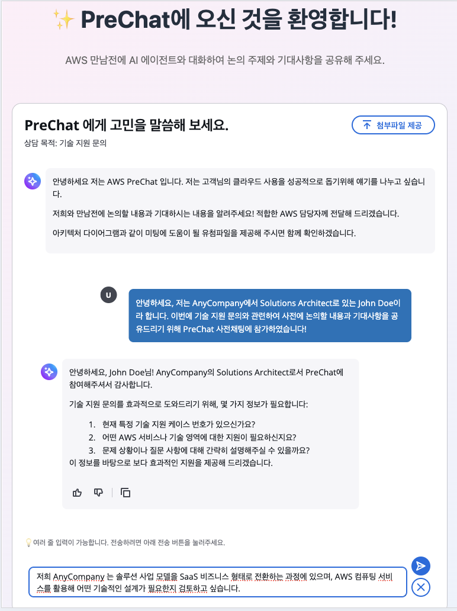
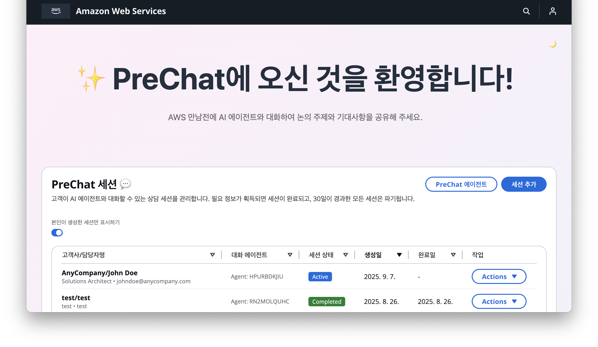
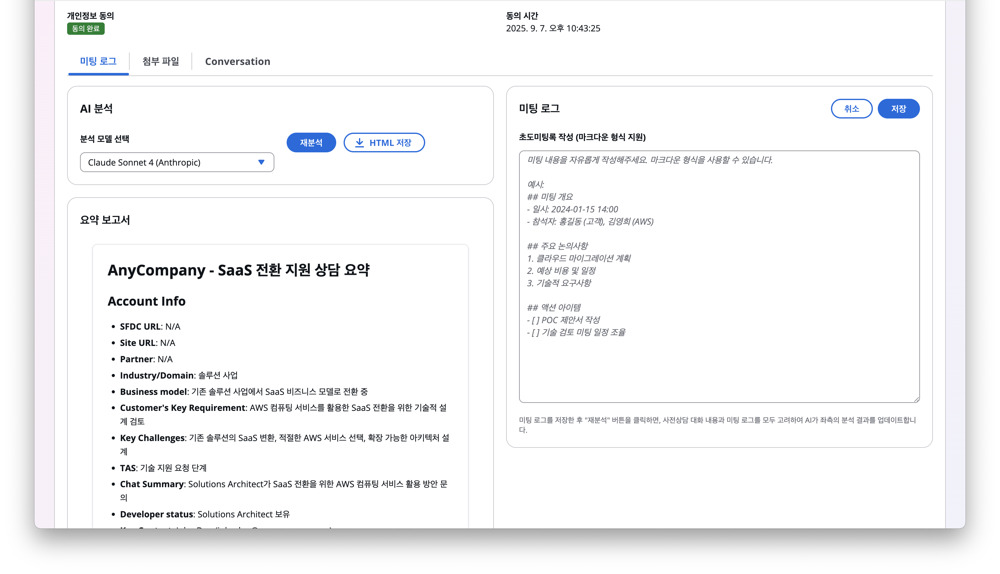

# PreChat: AI-Powered Pre-Consultation System on AWS

> Build a chat-based pre-consultation system using Amazon Bedrock AgentCore and Strands SDK for intelligent customer interactions and automated report generation.

[](LICENSE)
[](https://aws.amazon.com/serverless/)
[](https://nodejs.org/)
[](https://www.python.org/)

Last Updated: 2026-02-28

**English** | [한국어](README.ko.md)

## Overview

PreChat replaces traditional form-based data collection with an AI chatbot interface. Through natural conversations, it collects business requirements from customers and automatically generates BANT analysis reports and meeting plans.

### Key Features

- **Conversational Consultation**: Strands SDK agents guide customers through structured dialogues
- **BANT Analysis**: AI automatically analyzes Budget/Authority/Need/Timeline after session completion
- **Meeting Plan Generation**: Customer reference search (KB RAG) + AWS Documentation MCP integration
- **Real-time Streaming**: WebSocket-based SSE streaming responses
- **Multilingual Support**: Full Korean/English support (i18n)
- **Event Triggers**: Automatic Slack/SNS notifications on session completion

## Website Sections After Deployment

| Section | Description | Preview |
|---------|-------------|---------|
| **Customer Chat Interface** | Interactive chatbot where customers engage in guided conversations. Features real-time AI responses, mobile-responsive design, and secure PIN-protected sessions. |  |
| **Admin Dashboard** | Management interface for consultation sessions. Includes session creation, monitoring, analytics with AI-generated reports and conversation history. |  |
| **Meeting Log Analysis** | AI-powered analysis and reporting system that generates session summaries, insights, and consultation effectiveness metrics from conversation data. |  |

## Architecture

```
┌─────────────────┐     ┌──────────────────┐     ┌──────────────────────────┐
│   React SPA     │     │   API Gateway    │     │   Lambda Functions       │
│  (CloudFront)   │◄───►│   (REST + WS)    │◄───►│   (Python 3.13)          │
│  Cloudscape UI  │     │                  │     │   Domain-isolated        │
└─────────────────┘     └──────────────────┘     └──────────┬───────────────┘
                                                            │
┌─────────────────┐     ┌──────────────────┐     ┌──────────▼───────────────┐
│  Cognito        │     │   DynamoDB       │     │  Bedrock AgentCore       │
│  (Admin Auth)   │     │  (KMS Encrypted) │     │  ┌─────────────────────┐ │
└─────────────────┘     │  Sessions Table  │     │  │ Consultation Agent  │ │
                        │  Messages Table  │     │  │ Summary Agent       │ │
┌─────────────────┐     │  Campaigns Table │     │  │ Planning Agent      │ │
│  S3 + CloudFront│     └──────────────────┘     │  └─────────────────────┘ │
│  (Static + Files)│                             │  Strands SDK + MCP       │
└─────────────────┘                              └──────────────────────────┘
```

## Project Structure

```
prechat/
├── packages/
│   ├── backend/              # Python Lambda (domain-isolated)
│   │   ├── session/          # Session CRUD, PIN auth, messages
│   │   ├── campaign/         # Campaign CRUD, analytics
│   │   ├── admin/            # Admin API, customization
│   │   ├── auth/             # Cognito authentication
│   │   ├── agent/            # Agent management/config
│   │   ├── trigger/          # Event triggers (Slack/SNS)
│   │   ├── file/             # File upload (S3)
│   │   ├── stream/           # DynamoDB Streams
│   │   ├── websocket/        # WebSocket handler
│   │   ├── meeting/          # Meeting plan
│   │   ├── migration/        # Migration
│   │   └── shared/           # Lambda Layer shared code
│   ├── web-app/              # React SPA (Vite + Cloudscape)
│   └── strands-agents/       # Strands SDK AI Agents (AgentCore)
│       ├── consultation-agent/  # Customer consultation agent
│       ├── summary-agent/       # BANT summary agent
│       └── planning-agent/      # Meeting plan + Sales Rep chat agent
├── template.yaml             # AWS SAM IaC
├── deploy-full.sh            # Full deploy (agents → SAM → frontend)
├── deploy-website.sh         # Frontend-only deploy
└── package.json              # Yarn Workspaces root
```

## Tech Stack

| Layer | Technology | Notes |
|-------|-----------|-------|
| Frontend | React 18 + Vite + Cloudscape | TypeScript, i18n (ko/en) |
| Backend | Python 3.13 Lambda | Domain-isolated, SharedLayer |
| AI Agents | Strands SDK + Bedrock AgentCore | Docker container deployment |
| MCP | AWS Documentation MCP Server | uvx-based, pre-installed in Dockerfile |
| Database | DynamoDB (KMS encrypted) | TTL auto-expiry, GSI |
| Auth | Cognito (Admin) + PIN (Customer) | JWT + 6-digit PIN |
| Infra | SAM + CloudFront + VPC | IaC, Private Subnet |
| Test | Vitest + fast-check | Property-based testing |

## Quick Start

### Prerequisites

- Node.js v20.18.1+, Yarn v1.22.22+
- Python 3.13, uv (uvx)
- AWS CLI v2, SAM CLI v1
- Docker (for agent builds)
- `bedrock-agentcore-starter-toolkit` (`pip install bedrock-agentcore-starter-toolkit`)

### Deployment

```bash
# 1. Install dependencies
yarn install

# 2. Full deploy (agents → SAM → frontend)
chmod +x deploy-full.sh deploy-website.sh
./deploy-full.sh [AWS_PROFILE] [STAGE] [REGION] [BEDROCK_REGION] [STACK_NAME] [BEDROCK_KB_ID]

# Defaults: default / dev / ap-northeast-2 / (REGION) / mte-prechat
```

Deploy order: `deploy-agents.sh` (AgentCore) → `sam deploy` (infra) → `deploy-website.sh` (frontend)

| Parameter | Default | Description |
|-----------|---------|-------------|
| `AWS_PROFILE` | `default` | AWS CLI profile |
| `STAGE` | `dev` | Deploy environment (dev/prod) |
| `REGION` | `ap-northeast-2` | AWS region |
| `BEDROCK_REGION` | Same as REGION | Bedrock model region |
| `STACK_NAME` | `mte-prechat` | CloudFormation stack name |
| `BEDROCK_KB_ID` | (none) | Knowledge Base ID (for reference search) |

### Post-Deployment

1. AWS Console → Amazon Bedrock → Model access: approve Claude/Nova models
2. Sign up for an admin account at `https://[cloudfront-domain]/admin`
3. Create PreChat Agent → Create Campaign → Create Session → Test customer chat

## Development

```bash
# Frontend dev server (port 5173)
yarn dev

# Lint all
yarn lint

# Test all (Vitest, single run)
yarn test

# SAM backend build
sam build

# Translation management
cd packages/web-app
yarn extract-text           # Extract translation keys
yarn manage-translations    # Manage translation files
yarn validate-translations  # Validate translations
```

### Redeployment Scope

| Changed | Scope | Command |
|---------|-------|---------|
| `packages/web-app/` | Frontend only | `./deploy-website.sh` |
| Domain dirs (`session/`, `campaign/`, etc.) | That Lambda only | `sam build && sam deploy` |
| `shared/` | Entire Lambda Layer | `sam build && sam deploy` |
| `template.yaml` | Full SAM | `sam build && sam deploy` |
| `strands-agents/` | That agent only | `./deploy-agents.sh` |

## AI Agents

Three Strands SDK agents are deployed as Docker containers on Bedrock AgentCore Runtime.

| Agent | Role | Memory | Tools |
|-------|------|--------|-------|
| Consultation Agent | Customer pre-consultation | STM (AgentCore Memory) | retrieve (KB RAG), render_form, current_time, AWS Docs MCP |
| Summary Agent | BANT framework analysis | None | None (Structured Output) |
| Planning Agent | Meeting plan + Sales Rep chat | None | retrieve (KB RAG), http_request, AWS Docs MCP |

Consultation Agent and Planning Agent integrate with AWS Documentation MCP Server, enabling real-time search of official AWS documentation to provide accurate information to customers.

See [packages/strands-agents/README.md](packages/strands-agents/README.md) for details.

## Data Model

### DynamoDB Tables

| Table | PK | SK | Purpose |
|-------|----|----|---------|
| SessionsTable | `SESSION#{sessionId}` | `METADATA` | Session data, customer info |
| MessagesTable | `SESSION#{sessionId}` | `MESSAGE#{messageId}` | Conversation messages |
| CampaignsTable | `CAMPAIGN#{campaignId}` | `METADATA` | Campaign settings |

All tables support KMS encryption, TTL auto-expiry (30 days), and GSI.

## Security

- Lambda runs in VPC Private Subnet
- DynamoDB KMS encryption (at rest)
- HTTPS TLS 1.2+ (in transit)
- Cognito JWT authentication (admin)
- 6-digit PIN authentication (customer)
- IAM least-privilege principle
- API keys/secrets managed via environment variables only (no hardcoding)

## Workflow

```
1. Admin: Create campaign → Create session → Send URL + PIN to customer
2. Customer: PIN auth → Select consultation purpose → Chat with AI → Submit feedback
3. System: Session complete → Summary Agent (BANT analysis) → Planning Agent (meeting plan)
4. Admin: Review AI report → Write meeting log → Chat with Planning Agent for meeting prep
```

## License

[MIT-0 (MIT No Attribution)](LICENSE) — All use permitted including commercial use, no attribution required.

## Documentation

- [DEPLOYMENT_GUIDE.md](DEPLOYMENT_GUIDE.md) — Detailed deployment guide
- [docs/API_REFERENCE.md](docs/API_REFERENCE.md) — API endpoint reference
- [docs/MIGRATION_GUIDE.md](docs/MIGRATION_GUIDE.md) — Migration guide
- [packages/strands-agents/README.md](packages/strands-agents/README.md) — AI agents detail
- [packages/web-app/README.md](packages/web-app/README.md) — Frontend detail

## Contact

📧 aws-prechat@amazon.com / jaebin@amazon.com
