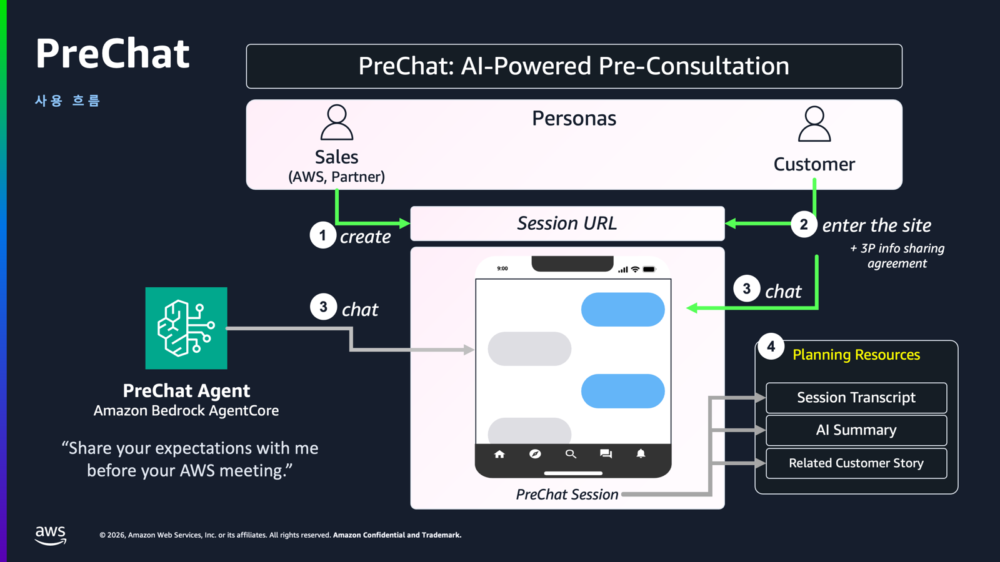
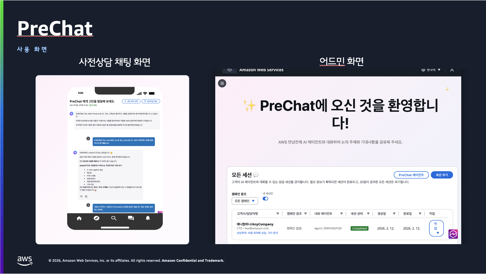

# PreChat 한눈에 보기

PreChat은 고객과의 **대화**만으로 사전상담 정보를 수집하고, AI가 BANT 분석 리포트와 미팅 플랜을 자동 생성하는 시스템입니다.

## 전체 흐름



### 관리자가 캠페인 생성

상담 목적이 정해진 캠페인(예: "FY26 신규 도입 상담")을 생성하고 에이전트를 연결합니다.



### 고객이 챗봇과 대화

세션 URL로 접속한 고객이 PIN 인증 후 상담 에이전트와 자연어로 대화하며 요구사항을 전달합니다.



### AI가 세션 정리

세션이 종료되면 요약 에이전트가 BANT 분석을 생성하고, 미팅 플랜 초안을 작성합니다.



### 영업팀이 미팅 준비

생성된 리포트와 플랜을 검토하고 고객과의 본 미팅을 준비합니다.



## 주요 화면

| 화면 | 역할 |
|------|------|
| **고객 챗 인터페이스** | 캠페인 URL + PIN으로 입장, 상담 에이전트와 실시간 대화, 대화 종료 후 피드백 제출 |
| **관리자 대시보드** | 캠페인/에이전트/세션 관리, 대화 로그 조회, AI 리포트 확인 |
| **캠페인 분석** | 캠페인별 세션 수, 상담 목적 분포, CSAT, 시간별 트렌드 |

## 구성 요소



- [React](https://react.dev/) + [Vite](https://vite.dev/) SPA
- [AWS Cloudscape](https://cloudscape.design/) 디자인 시스템
- [CloudFront](https://docs.aws.amazon.com/cloudfront/) + [S3](https://docs.aws.amazon.com/s3/) 호스팅
- 한국어/영어 i18n 지원



- Python 3.13 [Lambda](https://docs.aws.amazon.com/lambda/) (도메인별 격리)
- [API Gateway](https://docs.aws.amazon.com/apigateway/) (REST + WebSocket)
- [DynamoDB](https://docs.aws.amazon.com/dynamodb/) + DynamoDB Streams
- [Cognito](https://docs.aws.amazon.com/cognito/) User Pool (관리자 인증)



- [Strands SDK](https://github.com/strands-agents/sdk-python) 기반 에이전트 프레임워크
- [Bedrock AgentCore](https://docs.aws.amazon.com/bedrock-agentcore/) Runtime (Docker 컨테이너)
- 상담 에이전트와 요약 에이전트 두 역할을 제공하며, 이를 상속해 목적에 맞는 에이전트를 자유롭게 정의
- [AWS Documentation MCP](https://github.com/awslabs/aws-documentation-mcp-server) 연동



- 6자리 PIN 기반 고객 세션 인증
- 인바운드 캠페인 PIN은 HMAC-SHA256 해시 저장 (평문 미저장)
- DynamoDB [KMS](https://docs.aws.amazon.com/kms/) 암호화 (전용 CMK)
- HTTPS/WSS 전송 암호화 (TLS 1.2+)
- Lambda 도메인별 최소 권한 IAM 정책



## 캠페인 유형

PreChat은 두 가지 캠페인 유형을 지원합니다. 고객에게 도달하는 방식에 따라 선택지가 나뉩니다.

## 아웃바운드 캠페인 (Outbound)

관리자가 세션을 **미리 생성**하고 고객별 URL + PIN을 개별 전달하는 방식입니다. 특정 고객을 지정하여 1:1 상담을 유도할 때 사용합니다.

관리자가 세션을 만들면 고유한 세션 URL과 PIN이 발급됩니다. 이를 이메일이나 메신저로 고객에게 전달하면, 고객은 해당 URL에 접속하여 PIN을 입력한 뒤 상담을 시작합니다. 세션의 생성·비활성화·삭제 등 생명주기를 관리자가 직접 통제할 수 있어, 개인 맞춤 상담이나 VIP 고객 대응에 적합합니다.

- 고객마다 고유 URL + PIN 발급
- 세션 상태를 관리자가 직접 통제
- 개인 맞춤 상담, VIP 대응에 적합

## 인바운드 캠페인 (Inbound)

고객이 **캠페인 URL**로 직접 접근하여 본인 정보를 입력한 뒤 세션을 스스로 생성하는 방식입니다. 불특정 다수를 대상으로 상담 접수를 받을 때 사용합니다.

고객은 공유된 캠페인 URL에 접속하여 이름/전화번호 등 PII를 입력하여 세션을 생성합니다. 동일 전화번호로 재진입하면 기존 세션이 복원되어 중복 세션이 방지됩니다. 

- 대규모 상담 접수에 적합 (이벤트, 웨비나 후속 등)
- 전화번호 기준 중복 세션 방지
- 캠페인 비활성화로 접수 일시 중단 가능

## AI 에이전트 구조

PreChat의 에이전트는 **상담**과 **요약** 두 가지 역할로 나뉩니다. 각 역할은 **기본 템플릿**을 제공하며, **프롬프트·모델·도구 조합**을 바꿔 목적에 맞는 에이전트를 자유롭게 정의합니다.

| 역할 | 시점 | 하는 일 |
|------|------|--------|
| **상담 에이전트** | 세션 중 | 고객과 대화, 질문 유도, 양식 렌더링, AWS 문서 검색 |
| **요약 에이전트** | 세션 종료 후 | 대화 로그를 BANT 프레임워크로 요약, 미팅 플랜 초안 작성 |

예를 들어 마이그레이션 전문 상담 에이전트, 비용 최적화 상담 에이전트처럼 같은 상담 역할이라도 프롬프트와 도구 구성을 달리한 여러 에이전트를 만들어 캠페인마다 연결합니다.

## 다음 단계

시스템이 누구를 위한 것인지 더 자세히 보려면 [유스케이스](personas-and-scenarios.md)로 이동합니다. 워크샵을 바로 시작하고 싶다면 [워크샵 체크리스트](workshop-checklist.md)를 확인합니다.