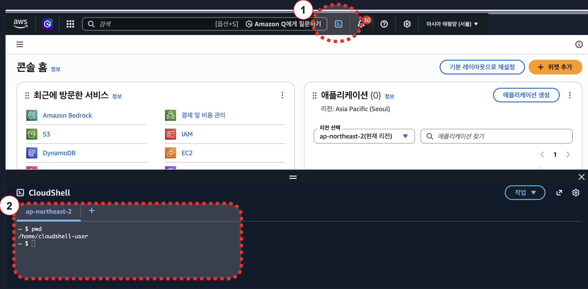

# AWS CloudShell로 시작하기 (권장)

CloudShell은 브라우저에서 바로 사용하는 AWS 인증된 쉘 환경입니다. AWS CLI, SAM CLI, Python, Node.js 20, Docker 클라이언트가 이미 구비되어 있어 워크샵에 가장 적합합니다.

## 1. CloudShell 실행

AWS Console에 로그인한 뒤 상단 헤더의 CloudShell 아이콘(터미널 모양)을 클릭합니다. 워크샵을 진행할 리전인지 확인합니다.



## 2. 도구 확인과 추가 설치

CloudShell에는 주요 도구가 이미 설치되어 있습니다. 아래 스크립트를 한 번에 실행하면 버전 확인과 추가 설치가 끝납니다.

```bash
# 기본 도구 버전 확인
aws --version && sam --version && node --version && git --version && echo "✅ 기본 도구 정상"

# uv 설치 (Python 버전 관리 + 에이전트 배포 도구에 필요)
curl -LsSf https://astral.sh/uv/install.sh | sh
source ~/.bashrc

# uv로 Python 3.13 설치 (CloudShell 기본 Python은 3.9이므로 별도 설치)
uv python install 3.13

# AgentCore Starter Toolkit 설치 (Python 3.13 환경에서 실행)
uv tool install bedrock-agentcore-starter-toolkit --python 3.13
```

## 3. AWS 자격증명 확인

CloudShell은 로그인한 IAM 엔터티의 자격증명을 자동으로 사용합니다.

```bash
aws sts get-caller-identity
```

`UserId`, `Account`, `Arn`이 나오면 정상입니다.

## 4. 다음 단계

CloudShell 준비가 끝났으면 [레포지토리 클론](../03-deploy/clone-repository.md)으로 이동합니다.

## 문제 해결

### Docker 명령이 실패

CloudShell의 Docker는 **클라이언트만** 제공됩니다. 에이전트 빌드는 원격 CodeBuild를 통해 진행되므로 로컬 Docker 엔진이 필요하지 않습니다. `docker build`를 직접 실행할 일은 없습니다.

### 세션이 끊기면 설치한 도구가 남아있나

CloudShell 홈 디렉토리(`/home/cloudshell-user`)는 세션 간 유지됩니다. `uv`로 설치한 Python과 도구도 홈에 저장되므로 재설치가 필요하지 않습니다.