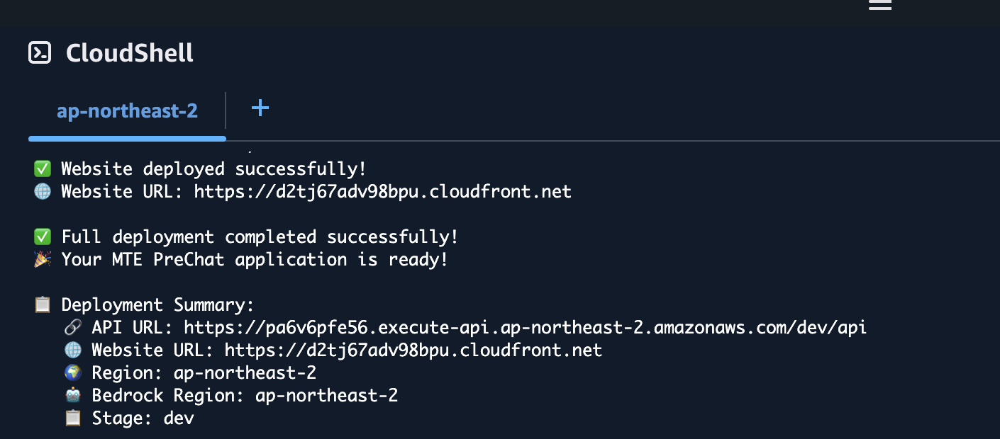
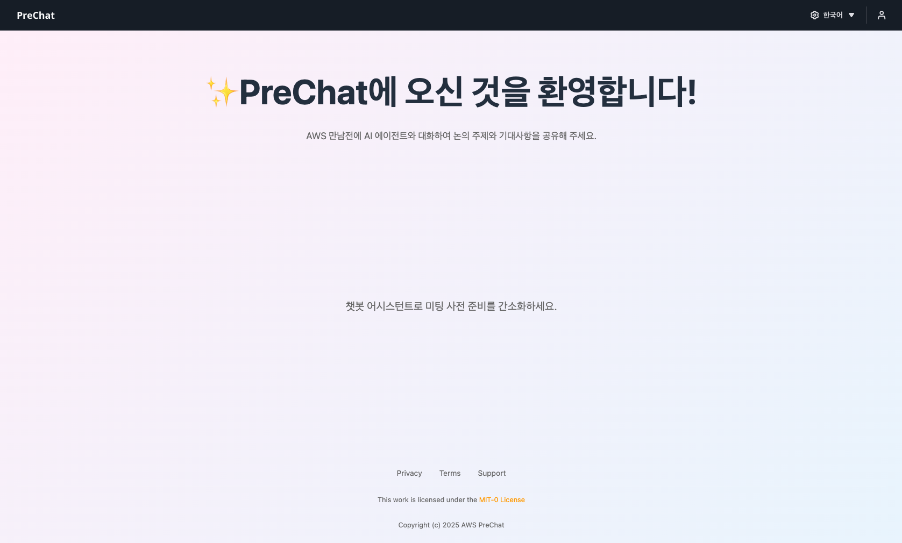

# 전체 배포

이 단계에서는 명령어 한 줄로 에이전트, 백엔드, 프론트엔드를 모두 배포합니다.

## 1. 배포 명령 실행

CloudShell에서 다음을 복사해 붙여넣고 Enter를 누릅니다.

```bash
cd /home/workshop/sample-prechat-ai
./deploy-full.sh default dev ap-northeast-2 ap-northeast-2 mte-prechat-workshop
```


배포는 10분 가량 소요됩니다. 중간에 터미널을 닫지 마세요.


## 2. 배포 완료 확인

모든 단계가 자동으로 진행됩니다. 마지막에 다음과 같은 요약이 출력되면 성공입니다.

```
✅ Full deployment completed successfully!
🎉 Your MTE PreChat application is ready!

📋 Deployment Summary:
   🔗 API URL: https://xxxx.execute-api.ap-northeast-2.amazonaws.com/dev/api
   🌐 Website URL: https://dxxx.cloudfront.net
   🌍 Region: ap-northeast-2
   🤖 Bedrock Region: ap-northeast-2
   📋 Stage: dev

🎯 Next steps:
   1. Access the admin dashboard at: https://dxxx.cloudfront.net/admin
   2. Configure Agent settings for your campaigns
   3. Create customer sessions and start chatting!
```



**Website URL을 메모장에 복사해 두세요.** 이후 모든 단계에서 이 URL을 사용합니다.



## 3. 배포가 중간에 실패했다면

실패한 지점부터 다시 실행하면 됩니다. 전체를 처음부터 돌릴 필요는 없습니다. 반복 실패하거나 에러 메시지를 해석하기 어렵다면 [문제 해결 가이드](../08-ops/troubleshooting.md)를 참고하거나, 워크샵 진행을 지원하는 팀에 문의하세요.



```bash
./packages/strands-agents/deploy-agents.sh default dev ap-northeast-2
```



```bash
sam build
sam deploy \
  --profile default \
  --region ap-northeast-2 \
  --stack-name mte-prechat-workshop \
  --resolve-s3 \
  --capabilities CAPABILITY_IAM CAPABILITY_NAMED_IAM \
  --parameter-overrides "Stage=dev BedrockRegion=ap-northeast-2"
```



```bash
./update-env-vars.sh default dev ap-northeast-2 mte-prechat-workshop
./deploy-website.sh dev default ap-northeast-2 mte-prechat-workshop
```



에러 메시지가 이해되지 않으면 [문제 해결 가이드](../08-ops/troubleshooting.md)를 참고하세요.

## 4. 배포 결과 검증

배포가 완료되면 아래 순서로 정상 동작을 확인합니다.

### CloudFormation 스택 상태

```bash
aws cloudformation describe-stacks \
  --stack-name mte-prechat-workshop \
  --region ap-northeast-2 \
  --query 'Stacks[0].StackStatus'
```

`CREATE_COMPLETE` 또는 `UPDATE_COMPLETE`가 출력되어야 합니다.

### 주요 Outputs 확인

```bash
aws cloudformation describe-stacks \
  --stack-name mte-prechat-workshop \
  --region ap-northeast-2 \
  --query 'Stacks[0].Outputs[?OutputKey==`WebsiteURL` || OutputKey==`ApiUrl` || OutputKey==`WebSocketUrl`].[OutputKey,OutputValue]' \
  --output table
```

세 URL(ApiUrl, WebSocketUrl, WebsiteURL)이 모두 채워져 있어야 합니다.

### SSM 파라미터 확인

에이전트 ARN이 SSM에 제대로 등록됐는지 봅니다.

```bash
aws ssm get-parameters-by-path \
  --path "/prechat/dev/agents" \
  --recursive \
  --region ap-northeast-2 \
  --query 'Parameters[].{Name:Name,Value:Value}' \
  --output table
```

`consultation/runtime-arn`과 `summary/runtime-arn` 두 항목이 있어야 합니다.

### 웹사이트 접속

브라우저에서 `WebsiteURL`을 열어 PreChat 첫 화면이 로드되는지 확인합니다.



화면이 비어 있거나 `Network Error`가 뜨면 CloudFront 캐시 무효화가 완료되지 않았을 수 있습니다. 1~3분 기다린 뒤 새로고침합니다.

## 다음 단계

[이메일 계정 가입하기](../04-admin/create-admin-account.md)로 이동합니다.