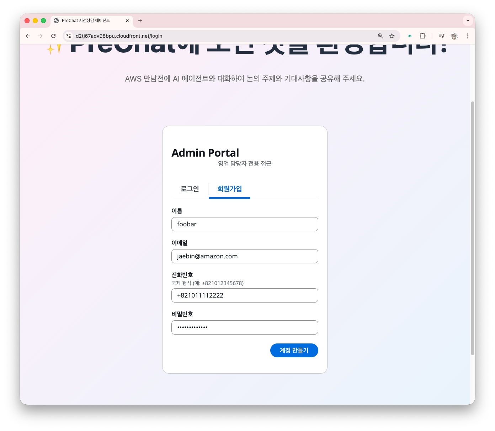
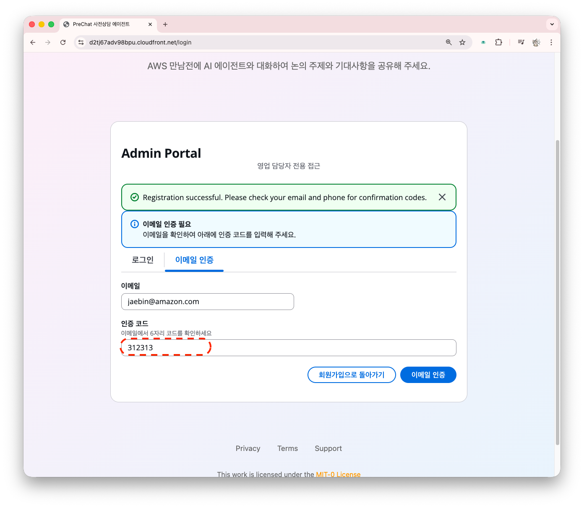
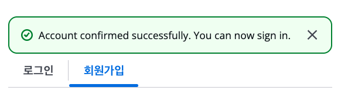
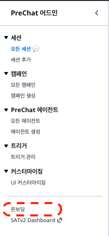

# 이메일 계정 가입하기

관리자 계정은 웹사이트에서 직접 가입합니다. 허용된 이메일 도메인만 가입하게 할 수 있습니다.

## 가입 절차



### 관리자 페이지로 이동

브라우저에서 `{WebsiteURL}/admin`을 엽니다.





### 회원가입 탭을 클릭





### 회원 정보를 입력



- **Email** — 허용 도메인 주소
- **Password** — 8자 이상, 대소문자 + 숫자
- **Name** — 표시 이름
- **Phone number** — 국가 코드 포함 (예: `+821012345678`)

입력을 완료하면 **계정 만들기** 버튼을 누르세요!




### 이메일 인증 코드를 입력

받은 편지함에서 6자리 코드를 확인합니다. (스팸함도 확인합니다.)
PIN 을 입력하고 **이메일 인증** 버튼을 확정합니다.







### 로그인

인증 완료 후 이메일/비밀번호로 로그인합니다. 





## 온보딩 체크리스트

좌측에서 온보딩 메뉴를 선택하세요. 6단계 온보딩 카드가 표시됩니다.

| 단계 | 설명 | 워크샵 순서 |
|------|------|----------|
| 1. 에이전트 만들기 | 상담 에이전트 생성 | 이번 섹션 |
| 2. 캠페인 만들기 | 캠페인 생성 | 다음 섹션 |
| 3. 세션 만들기 | 아웃바운드 세션 체험 | 5장 |
| 4. 고객과 대화하기 | 고객 대화 체험 | 5장 |
| 5. AI 리포트 확인 | BANT 요약 확인 | 6장 |
| 6. 캠페인 분석 | 캠페인 분석 | 7장 |




## 추가 사항

<details>
<summary>이메일 도메인 확인 (시스템 어드민용)</summary>

관리자 가입은 `AllowedEmailDomains` 파라미터로 제한할 수 있습니다. `prsworkshop` 브랜치 배포는 이메일 도메인을 제한하지 않습니다. **프로덕션에서 반드시 설정**해주셔야 합니다.


본인 이메일 도메인이 포함되지 않으면 시스템 어드민에게 재배포를 요청합니다.

```bash
aws cloudformation describe-stacks \
  --stack-name mte-prechat-workshop \
  --region ap-northeast-2 \
  --query 'Stacks[0].Parameters[?ParameterKey==`AllowedEmailDomains`].ParameterValue' \
  --output text
```

```bash
sam deploy \
  --parameter-overrides "Stage=dev BedrockRegion=ap-northeast-2 AllowedEmailDomains=amazon.com,mycompany.com"
```


</details>

<details>
<summary>문제 해결</summary>

**"User cannot be confirmed. Current status is CONFIRMED"**

이미 가입된 이메일입니다. "Forgot password?"로 비밀번호를 재설정하거나 다른 이메일로 가입합니다.

**인증 코드 이메일이 오지 않음**

- 스팸/광고 폴더를 확인합니다.
- 긴급한 경우 시스템 어드민에게 Cognito Console에서 수동 인증을 요청합니다.

**"Email domain not allowed"**

시스템 어드민에게 `AllowedEmailDomains` 파라미터 확장을 요청합니다.

</details>

## 다음 단계

계정이 준비되면 [에이전트 생성과 프롬프트 작성](create-agent.md)으로 이동합니다.