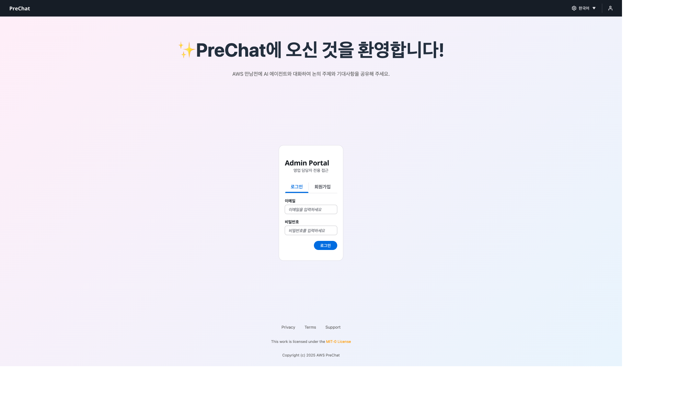
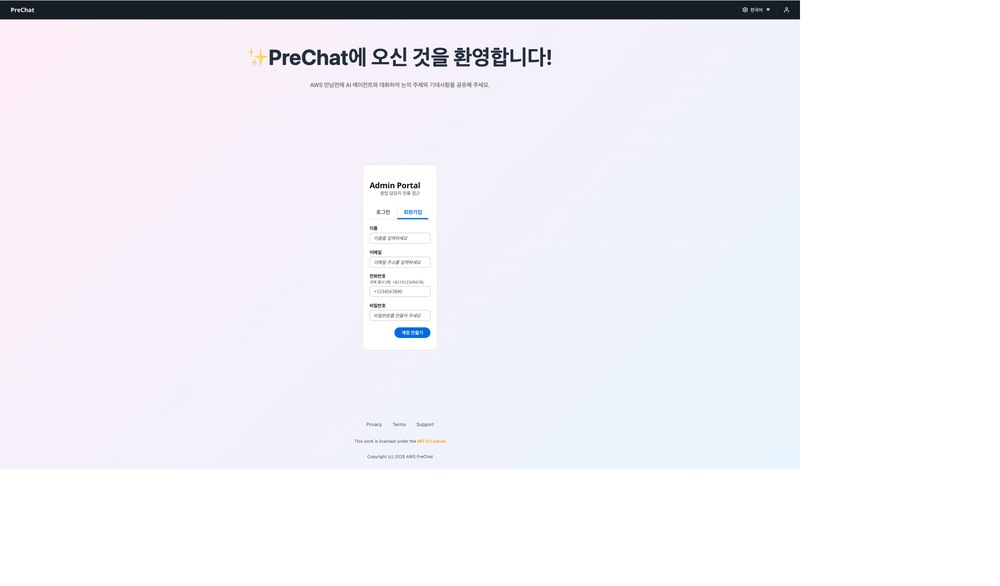
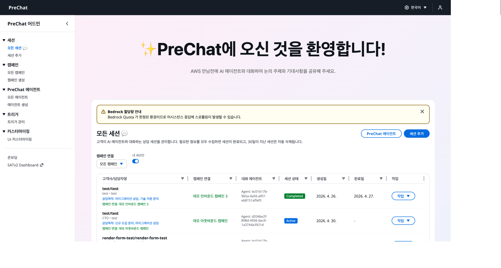
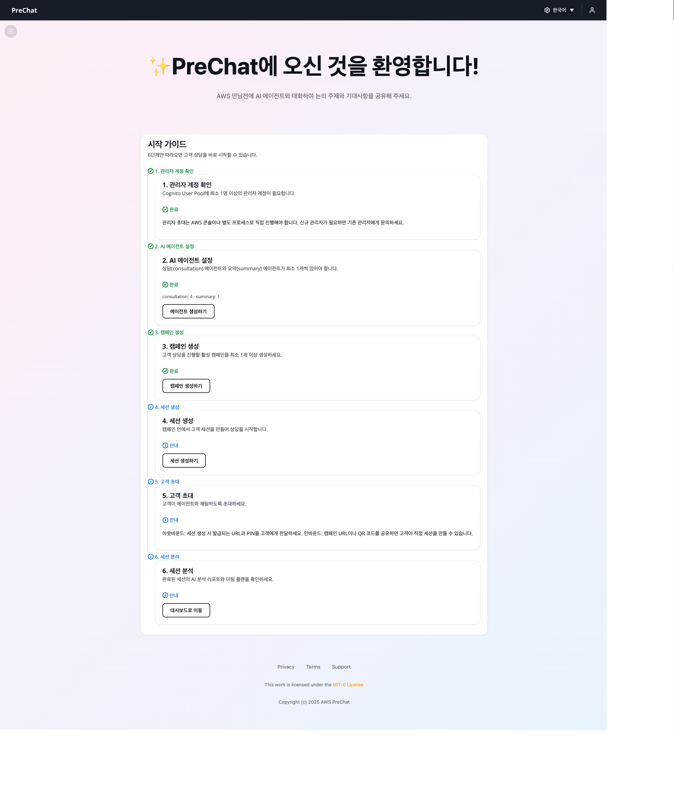

# 관리자 계정 만들기

PreChat은 Amazon Cognito로 관리자를 인증합니다. 첫 관리자 계정은 웹사이트에서 직접 가입합니다.

## 이메일 도메인 확인

관리자 가입은 `AllowedEmailDomains` 파라미터로 제한됩니다. 배포 시 기본값은 `amazon.com,your-email-domain.com`입니다.

```bash
aws cloudformation describe-stacks \
  --stack-name mte-prechat-workshop \
  --region ap-northeast-2 \
  --query 'Stacks[0].Parameters[?ParameterKey==`AllowedEmailDomains`].ParameterValue' \
  --output text
```

본인 이메일 도메인이 포함되지 않으면 재배포로 확장합니다.

```bash
sam deploy \
  --parameter-overrides "Stage=dev BedrockRegion=ap-northeast-2 AllowedEmailDomains=amazon.com,mycompany.com"
```

## 가입 절차



### 관리자 페이지로 이동한다

브라우저에서 `{WebsiteURL}/admin`을 엽니다.





### "Sign up"을 클릭한다

하단의 "Don't have an account? Sign up" 링크를 누릅니다.





### 회원 정보를 입력한다

- **Email** — 수신 가능한 주소 (허용 도메인이어야 함)
- **Password** — 최소 8자, 대소문자 + 숫자 포함
- **Name** — 표시 이름
- **Phone number** — 국가 코드 포함 (예: `+821012345678`)





### 이메일로 전송된 6자리 인증 코드를 입력한다

제목: "[AWS PreChat] Your sign-in code"

스팸함도 확인합니다.

**[수동 캡처 필요]** 이메일 인증 화면



### 로그인한다

인증 완료 후 로그인 화면으로 돌아와 이메일/비밀번호를 입력합니다.





## 온보딩 체크리스트

로그인하면 6단계 온보딩 카드가 표시됩니다. 워크샵에서는 다음 순서로 진행합니다.

| Quest | 설명 | 워크샵 순서 |
|-------|------|----------|
| 1. Create an Agent | 상담 에이전트 생성 | 이번 섹션 |
| 2. Create a Campaign | 캠페인 생성 | 다음 섹션 |
| 3. Create a Session | 아웃바운드 세션 체험 | 5장 |
| 4. Chat with a Customer | 고객 대화 체험 | 5장 |
| 5. Review AI Report | BANT 요약 확인 | 6장 |
| 6. Analyze Campaigns | 캠페인 분석 | 7장 |



## 추가 관리자 초대

추가 관리자는 같은 화면에서 회원가입하면 됩니다. 이메일 도메인 제한을 통과해야 합니다.


Cognito User Pool에서 관리자 권한으로 사용자를 직접 생성하려면 AWS Console → **Cognito** → **User Pools** → `mte-admin-users` → **Users** → **Create user**에서 만들고, 임시 비밀번호를 사용자에게 전달합니다.


## 다음 단계

계정이 준비되면 [에이전트 생성과 프롬프트 작성](create-agent.md)으로 이동합니다.

## 문제 해결

### "User cannot be confirmed. Current status is CONFIRMED"

이미 가입된 이메일입니다. 로그인 화면에서 "Forgot password?"로 비밀번호를 재설정하거나, 다른 이메일로 가입합니다.

### 인증 코드 이메일이 오지 않음

- 스팸/광고 폴더 확인
- Cognito는 SES 샌드박스 제한으로 일일 발송 건수가 제한될 수 있습니다. AWS Console → **Cognito** → **User Pools** → `mte-admin-users` → **Messaging**에서 SES 구성을 검토하세요.
- 긴급한 경우 AWS Console → **Cognito** → **Users**에서 해당 사용자의 **Confirm account**로 이메일 인증을 건너뛸 수 있습니다.

### "Email domain not allowed"

`AllowedEmailDomains` 파라미터를 확장해 재배포합니다.
