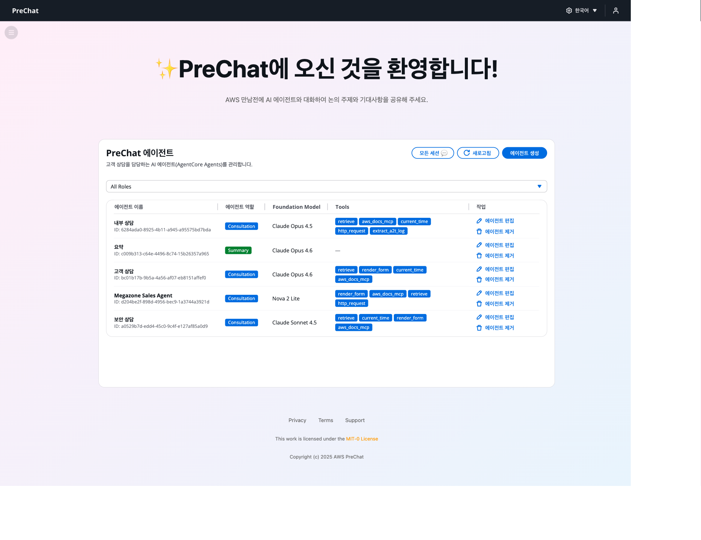
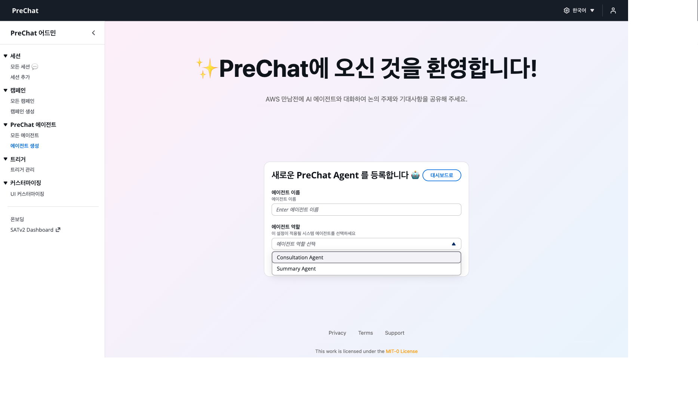
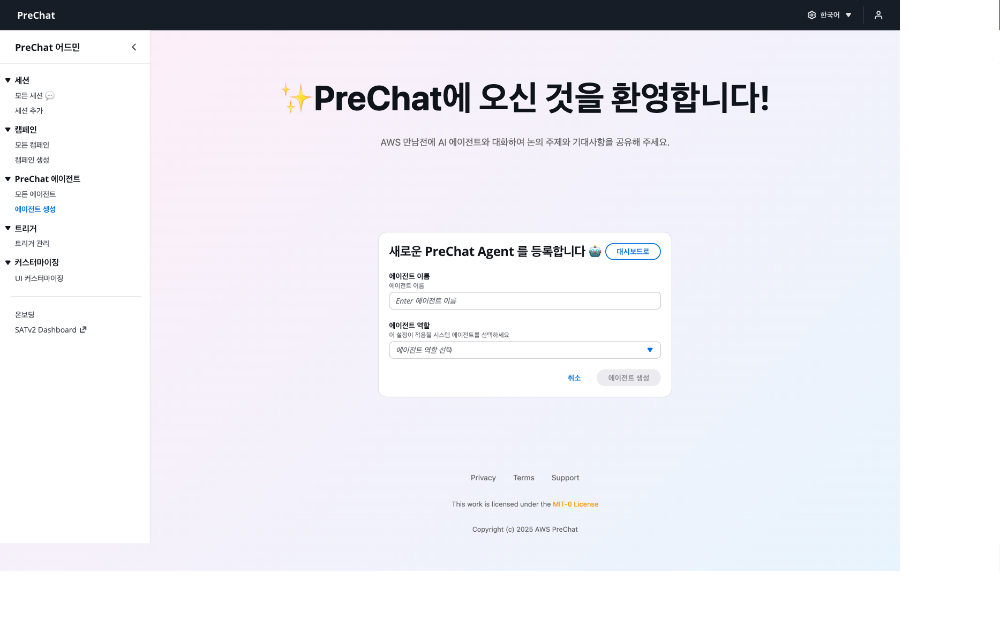
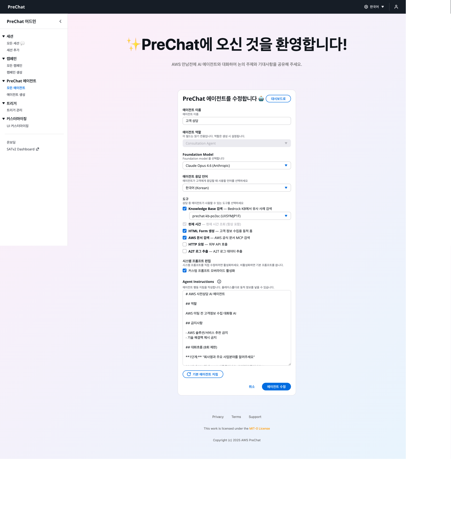

# 에이전트 생성과 프롬프트 작성

에이전트는 고객 대화를 담당하는 AI 구성 객체입니다. 캠페인에 연결해 사용합니다.

## 생성 절차



### 에이전트 페이지로 이동한다

대시보드 좌측 메뉴 → **Agents** → **Create Agent** 버튼을 클릭합니다.





### 이름을 정한다

예: `workshop-consultation-ko`

관리자만 보는 식별용 이름입니다.



### 모델을 선택한다

드롭다운에서 Bedrock 모델을 고릅니다.

- **Anthropic Claude 3.5 Sonnet** — 범용, 높은 품질
- **Amazon Nova Pro** — 한국어 품질 우수, 빠른 응답
- **Amazon Nova Lite** — 비용 절감용





### 시스템 프롬프트를 작성한다

고객과 대화할 때의 역할, 톤, 수집할 정보를 지정합니다. 아래 예시를 복사해 사용합니다.

```
당신은 ACME 솔루션즈의 AI 사전상담 어시스턴트입니다.

역할:
- 잠재 고객이 ACME 제품 도입을 검토할 수 있도록 필요한 정보를 수집합니다.
- 친근하면서도 전문적인 톤을 유지합니다.

반드시 파악할 정보:
1. 고객 회사의 업종과 규모
2. 현재 사용 중인 솔루션 또는 도구
3. 도입을 고려하는 배경과 비즈니스 목표
4. 예상 도입 시기와 예산 규모
5. 의사결정 프로세스와 주요 이해관계자

대화 가이드:
- 한 번에 하나의 주제에만 집중합니다.
- 고객이 모호하게 답하면 구체적인 질문으로 follow-up합니다.
- 기술 질문이 나오면 AWS 공식 문서 검색 도구를 활용합니다.
- 대화 종료 전 파악한 내용을 간단히 요약하고 고객의 확인을 받습니다.
```




프롬프트는 한국어/영어 모두 가능합니다. 고객이 사용할 언어에 맞춰 작성합니다.




### 도구를 선택한다

워크샵에서는 **`render_form` + `aws_docs_mcp`** 두 가지로 시작합니다.

| 도구 | 용도 | 권장 |
|------|------|------|
| `retrieve` | Knowledge Base RAG 검색 | 유사 사례/문서 제공 시 |
| `render_form` | 구조화된 정보 수집 폼 렌더링 | 항상 권장 |
| `aws_docs_mcp` | AWS 공식 문서 실시간 검색 | 기술 상담에 권장 |
| `current_time` | 현재 시간 조회 | 일정 논의에 권장 |
| `http_request` | 외부 API 호출 | 고급 통합 |





### Agent를 저장하고 Prepare를 실행한다

**Save** → **Prepare** 버튼을 순서대로 클릭합니다. Status가 `PREPARED`로 바뀌면 완료입니다.





<details>
<summary>에이전트 관리 팁</summary>

**프롬프트 이터레이션**

테스트 세션 후 대화 로그를 보고 프롬프트를 개선합니다. 에이전트 상세 페이지에서 시스템 프롬프트를 편집하면 기존 캠페인에도 즉시 반영됩니다.

**여러 에이전트 운영**

업종별, 제품별로 별도 에이전트를 만들면 관리가 편합니다.

| 에이전트 | 용도 |
|---------|-----|
| `kr-enterprise-ko` | 한국 엔터프라이즈 신규 도입 |
| `kr-migration-ko` | 한국 마이그레이션 상담 |
| `global-partner-en` | 글로벌 파트너 영문 상담 |

</details>

<details>
<summary>Knowledge Base 연결 (선택)</summary>

`retrieve` 도구를 선택했다면 Knowledge Base ID를 지정합니다.

KB가 없다면 AWS Console → **Amazon Bedrock** → **Knowledge bases** → **Create knowledge base**에서 생성합니다. 데이터 소스로 S3 버킷(고객 사례, 제품 문서, FAQ 등)을 지정합니다.

캠페인마다 다른 KB를 쓰고 싶다면 에이전트를 복제해 `kb_id`만 바꿉니다.

</details>

## 다음 단계

에이전트 준비가 끝났으면 [캠페인 만들기](create-campaign.md)로 이동합니다.