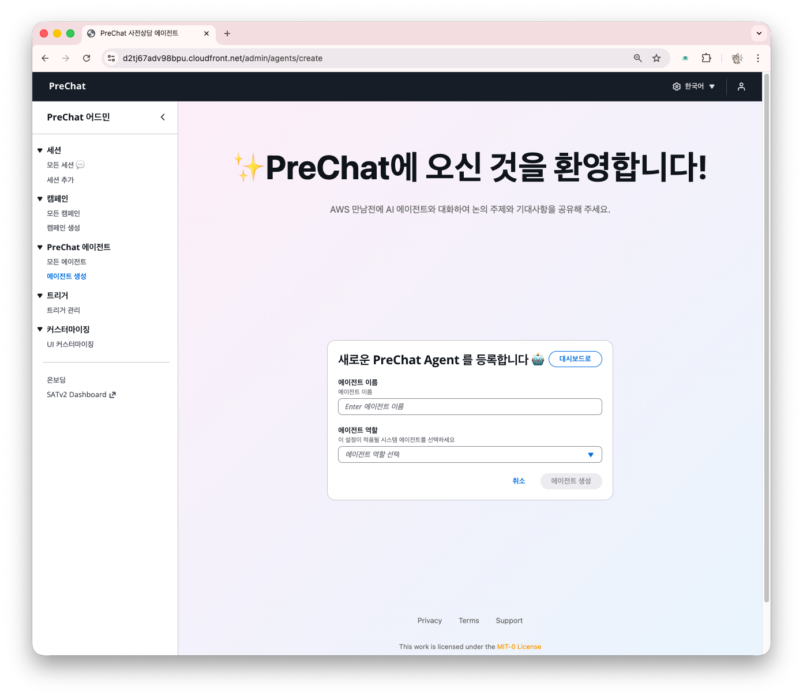
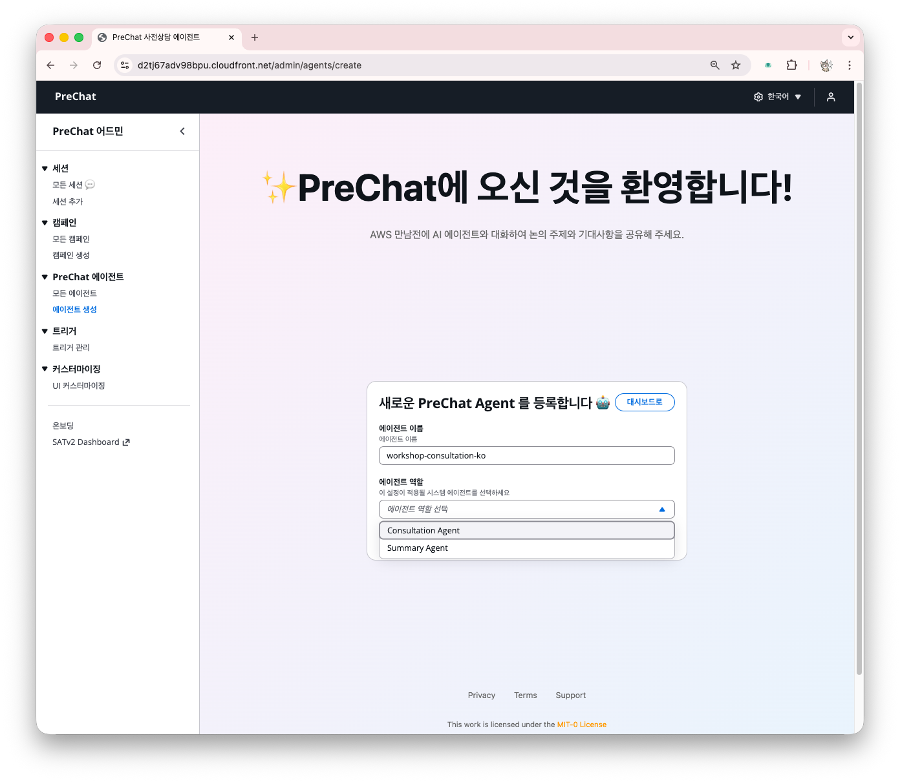
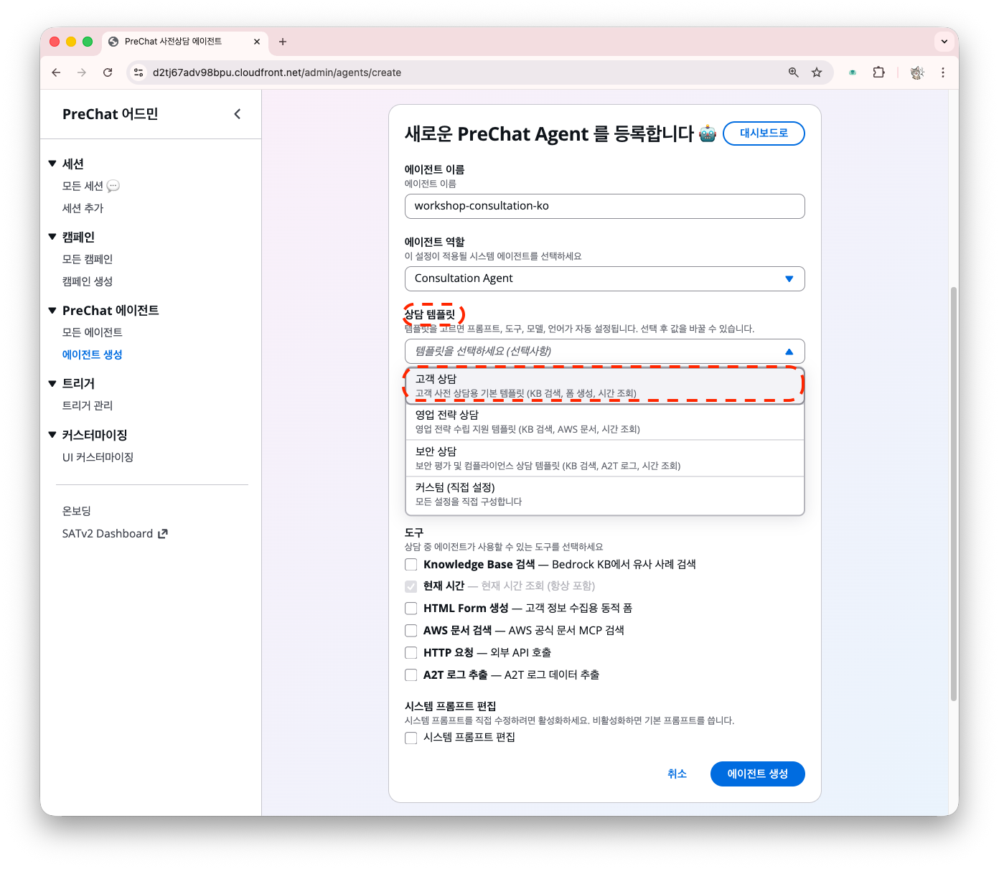
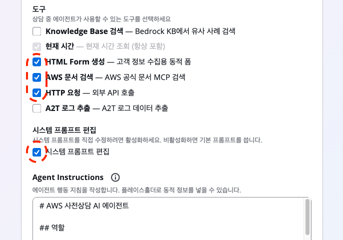
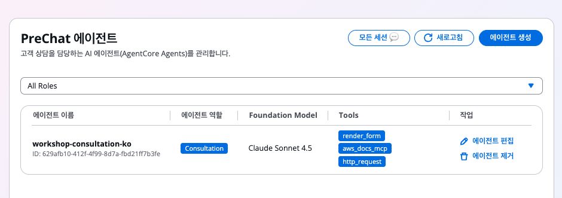
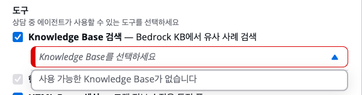
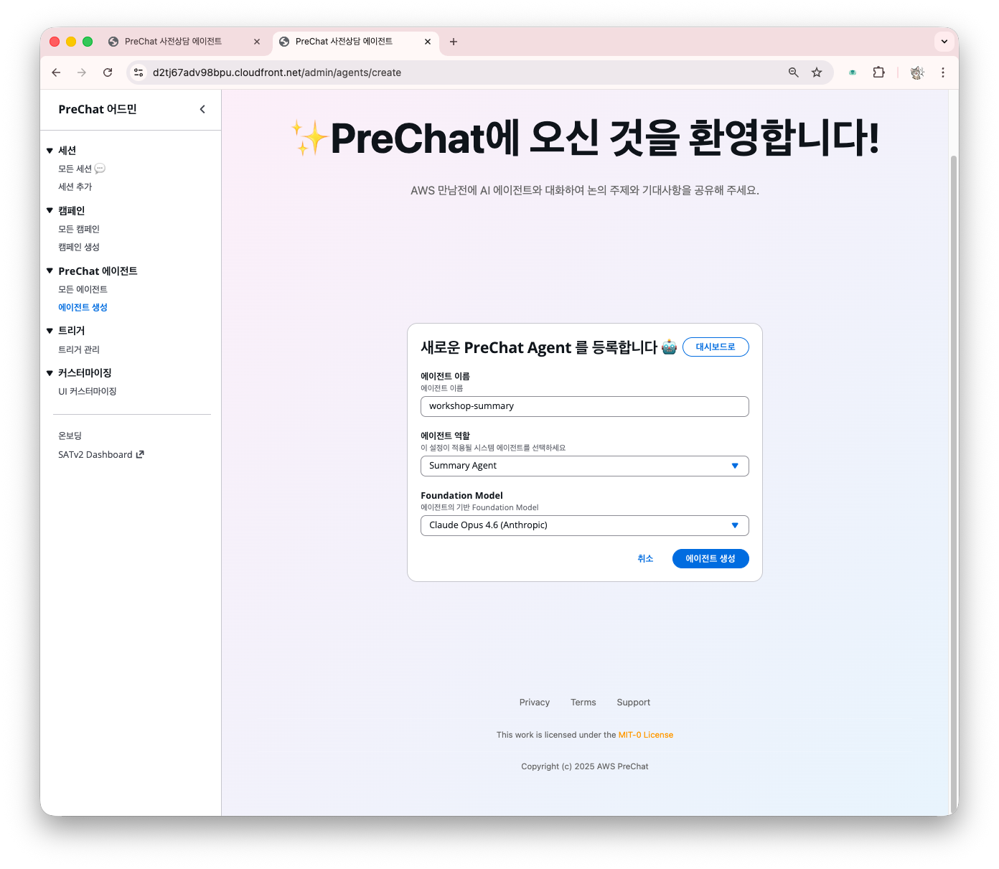

# 에이전트 생성과 프롬프트 작성

에이전트는 고객 대화를 담당하는 AI 요소입니다. 캠페인이나 대화 세션에 연결해 사용합니다.

## 에이전트 역할

PreChat에는 두 가지 역할의 에이전트가 있습니다. 각각 목적이 다르므로 최소 하나씩 만들어야 합니다.

| 역할 | 언제 동작하나 | 하는 일 |
|------|-------------|--------|
| **Consultation Agent** | 고객이 챗봇과 대화할 때 | 시스템 프롬프트에 따라 고객과 대화하며 요구사항을 수집 |
| **Summary Agent** | 세션 종료 후 자동 실행 | 대화 내용을 분석하여 BANT 요약과 미팅 플랜을 생성 |

Consultation Agent는 프롬프트, 도구, 언어를 자유롭게 설정합니다. Summary Agent는 모델만 선택하면 됩니다(프롬프트는 시스템이 자동 주입).

## 생성 절차



### 에이전트 페이지로 이동

온보딩 카드 또는,

대시보드 좌측 메뉴 → **PreChat 에이전트** → **에이전트 생성** 클릭





### 이름과 역할 지정

- **이름** — 용도를 알 수 있게 작성 (예: `workshop-consultation-ko`)
- **역할** — `Consultation Agent` 선택




역할에 따라 이후 입력 필드가 달라집니다.



### 템플릿 선택 (Consultation 전용)

Consultation Agent를 선택하면 사전 정의된 템플릿이 표시됩니다. 템플릿을 고르면 프롬프트, 도구, 모델이 자동으로 채워집니다.

| 템플릿 | 용도 | 기본 모델 |
|--------|------|----------|
| **고객 사전상담** | 범용 고객 요구사항 수집 | Nova 2 Lite |
| **영업 전략 상담** | 영업 시나리오 기반 심층 상담 | Claude Sonnet 4.5 |
| **보안 점검 상담** | 보안 체계 파악 및 SHIP 안내 | Claude Sonnet 4.5 |
| **직접 작성** | 빈 상태에서 시작 | 선택 필요 |

워크샵에서는 **고객 사전상담** 템플릿으로 시작하는 것을 권장합니다.






### 모델 선택

드롭다운에서 Foundation Model을 고릅니다. 모든 모델은 Cross-Region Inference로 제공됩니다.

| 모델 | 제공사 | 특징 |
|------|--------|------|
| **Nova 2 Lite** | Amazon | 비용 효율적 멀티모달 모델. 문서 처리, 고객 지원 자동화에 적합. 컨텍스트 1M 토큰 |
| **Claude Haiku 4.5** | Anthropic | 속도와 효율에 최적화된 경량 모델. 코딩과 에이전트 성능이 우수. 컨텍스트 200K 토큰 |
| **Claude Sonnet 4.5** | Anthropic | 에이전트, 코딩, 복잡한 추론에 최적화. 벤치마크 전반에서 높은 성능. 컨텍스트 200K 토큰 |
| **Claude Opus 4.5** | Anthropic | 최고 수준 추론 능력. 복잡한 분석과 장문 생성에 적합. 컨텍스트 200K 토큰 |
| **Claude Opus 4.6** | Anthropic | Opus 최신 버전. 컨텍스트 1M 토큰 |


워크샵에서는 툴링을 고려해 **Claude Sonnet 4.5** (Consultation)와 **Claude Opus 4.6** (Summary)를 권장합니다. 






### 시스템 도구 선택

PreChat 에서는 AWS 사전상담 유스케이스를 위해 필요한 도구들이 미리 정의되어 있습니다. 워크샵 실습을 위해 사진과 같은 도구들을 선택합니다.

| 도구 | 용도 | 워크샵 권장 |
|------|------|-----------|
| `render_form` | 구조화된 정보 수집 폼을 대화 중 렌더링 | ✅ |
| `aws_docs_mcp` | AWS 공식 문서 실시간 검색 | ✅ (기술 상담) |
| `retrieve` | Knowledge Base RAG 검색 (KB ID 지정 필요) | 선택 |
| `http_request` | 외부 API 호출 | 고급 |
| `extract_a2t_log` | A2T 로그 데이터 추출 | 보안 상담 전용 |
| `current_time` | 현재 시간 조회 | 자동 포함 |

*`current_time`은 항상 포함됩니다.





이러한 에이전트 도구 세트는, AWS 및 AWS 구축 파트너사를 위해 미리 정의된 것입니다. 우리 사용사례를 위한 개별 도구를 지원하고 싶다면 소스코드를 편집해야 합니다. PreChat은 개별 편집 방식으로 사용이 의도된 오픈소스입니다.





### 시스템 프롬프트 작성 (Consultation 전용)

고객과 대화할 때의 역할, 톤, 수집할 정보를 지정합니다. 템플릿을 선택했다면 이미 채워져 있으므로 필요한 부분만 수정합니다.

여러분 기업과 제품에 대한 맥락 + 에이전트 행동 지침을 자유롭게 구술해보세요.

참고 예시는 AWS 클라우드 구축 파트너사를 예로하였습니다. 

```
당신은 ACME 솔루션즈의 AI 사전상담 어시스턴트입니다.

역할:
- 잠재 고객이 AWS 클라우드 구축과 관련한 ACME 오퍼링을 검토할 수 있도록 필요한 정보를 수집합니다.
- 친근하면서도 전문적인 톤을 유지합니다.

반드시 파악할 정보:
1. 고객 회사의 업종과 규모
2. 현재 사용 중인 AWS 솔루션 또는 도구
3. 도입을 고려하는 배경과 비즈니스 목표
4. 예상 도입 시기와 예산 규모
5. 의사결정 프로세스와 주요 이해관계자

대화 가이드:
- 한 번에 하나의 주제에만 집중합니다.
- 고객이 모호하게 답하면 구체적인 질문으로 follow-up합니다.
- 기술 질문이 나오면 AWS 공식 문서 검색 도구를 활용합니다.
- 자연스러운 대화체 문장으로 응답하세요. 친구에게 설명하듯 내러티브하게 이어 쓰세요.
- 대화 종료 전 파악한 내용을 간단히 요약하고 고객의 확인을 받습니다.

금지 사항:
- 기술에 깊게 들어가지 말고 미팅 팔로업을 유도하세요.
- 불필요한 수식어나 감탄사를 자제하세요.
- 이모지(emoji), 이모티콘, 특수 장식 문자 절대 금지
- 과도한 감정 표현("정말 대단하시네요!", "와~ 좋습니다!") 대신 사실 기반의 담백한 응대를 하세요.
- 공감은 하되 절제된 표현으로: "말씀 감사합니다", "확인했습니다", "좋은 정보입니다"

**대화 8회 초과, 담당자 정보 요청시:**
담당자 정보:
- {{sales_rep.name}}
- {{sales_rep.phone}}
- {{sales_rep.email}}

대화를 마치면 EOF 토큰을 생성하여 종료를 마킹하세요.
```

### 플레이스홀더 변수

시스템 프롬프트에서 이중 중괄호(`{{ }}`)로 감싼 변수를 사용하면, 에이전트가 대화 중 해당 값을 고객에게 안내합니다. 세션을 생성한 영업 담당자의 Cognito 프로필 정보가 자동으로 연결됩니다.

| 변수 | 설명 | 예시 출력 |
|------|------|----------|
| `{{sales_rep.name}}` | 세션을 생성한 영업 담당자 이름 | 김영업 |
| `{{sales_rep.phone}}` | 담당자 전화번호 | +821012345678 |
| `{{sales_rep.email}}` | 담당자 이메일 | sales@company.com |


프롬프트는 한국어/영어 모두 가능합니다. 고객이 사용할 언어에 맞춰 작성합니다.




### 저장

편집한 내용을 저장하기 위해 **에이전트 생성**을 눌러주세요.






<details>
<summary>에이전트 관리 팁</summary>

**프롬프트 이터레이션**

테스트 세션 후 대화 로그를 보고 프롬프트를 개선합니다. 에이전트 상세 페이지에서 시스템 프롬프트를 편집하면 기존 캠페인에도 즉시 반영됩니다.

**여러 에이전트 운영**

업종별, 제품별로 별도 에이전트를 만들면 관리가 편합니다.

| 에이전트 | 용도 |
|---------|-----|
| `kr-enterprise-ko` | 한국 엔터프라이즈 신규 도입 |
| `kr-migration-ko` | 한국 마이그레이션 상담 |
| `global-partner-en` | 글로벌 파트너 영문 상담 |

</details>

<details>
<summary>Knowledge Base 연결 (선택)</summary>



`retrieve` 도구를 선택했다면 Knowledge Base ID를 지정해야 합니다.

KB가 없다면 AWS Console → **Amazon Bedrock** → **Knowledge bases** → **Create knowledge base**에서 생성해야 합니다. [AWS 문서](https://docs.aws.amazon.com/ko_kr/bedrock/latest/userguide/knowledge-base-create.html)를 참고해 보세요.

</details>

## Summary Agent

Summary Agent는 역할 선택 시 `Summary Agent`를 고르고, 모델만 지정하면 됩니다. 프롬프트와 도구는 시스템이 자동으로 관리합니다.

아래 내용으로 요약 에이전트도 만들어 주세요.

- **이름** — (예: `workshop-summary`)
- **역할** — `Summary Agent` 선택
- **모델** — 워크샵에서는 **Claude Opus 4.6** 을 권장합니다. 




단계를 진행하려면 상담 에이전트와 요약 에이전트 모두 하나 이상 만들어 주세요.


## 다음 단계

에이전트 준비가 끝났으면 [캠페인 만들기](create-campaign.md)로 이동합니다.
