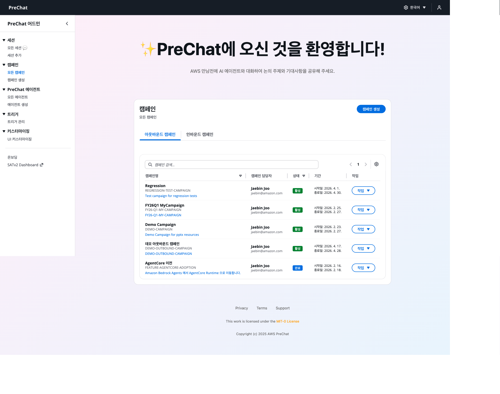
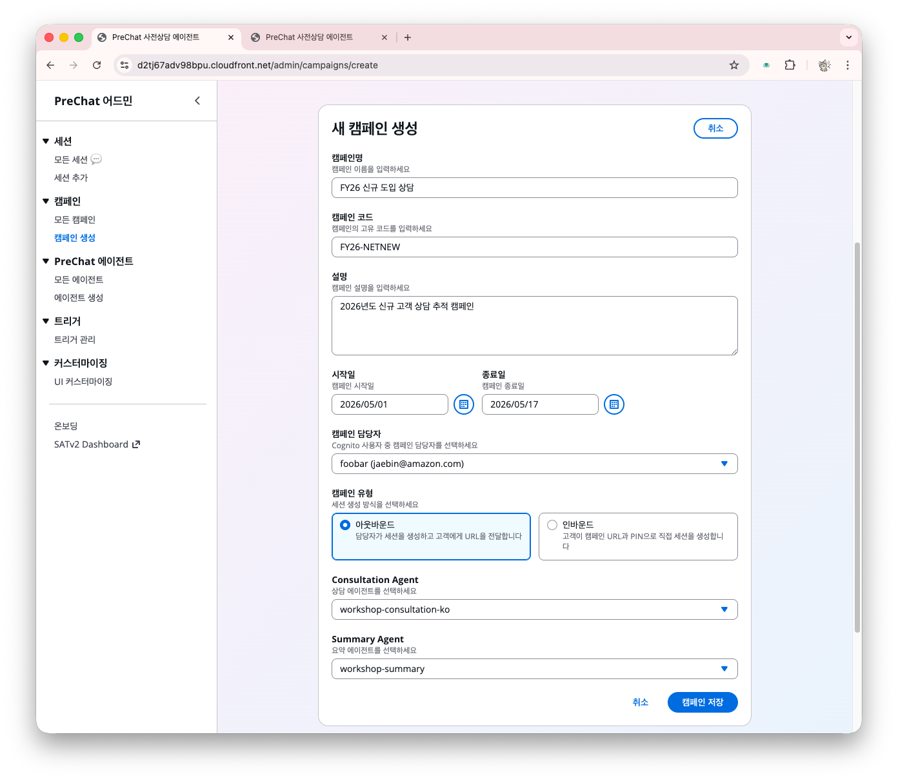
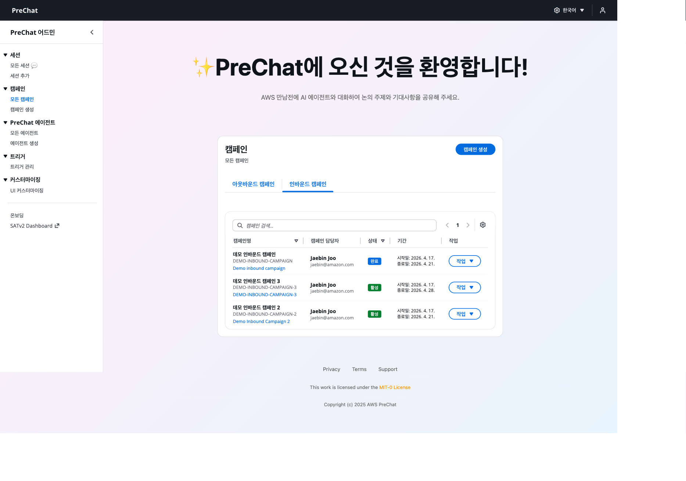
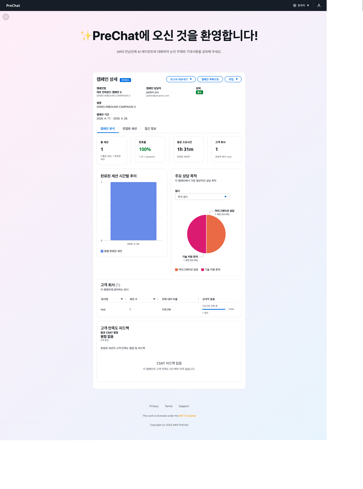

# 캠페인 만들기 — 아웃바운드와 인바운드

캠페인은 에이전트와 세션을 묶는 최상위 단위입니다. 아웃바운드와 인바운드 두 유형을 모두 생성합니다.

## 유형 선택

| 속성 | 아웃바운드 | 인바운드 |
|------|----------|---------|
| 세션 생성 주체 | 관리자가 사전 생성 | 고객이 URL 접근 시 자동 생성 |
| PIN 관리 | 세션마다 고유 (6자리) | 캠페인 공통 PIN |
| URL | 세션별 고유 | 캠페인 URL + 공통 PIN |
| 중복 방지 | 세션 단위 | 전화번호 기반 |
| 적합한 상황 | 1:1 맞춤 상담 | 대규모 접수, 셀프 신청 |

## 1. 아웃바운드 캠페인 만들기



### 캠페인 페이지로 이동한다

대시보드 → **Campaigns** → **Create Campaign** 클릭





### 기본 정보를 입력한다

- **Campaign Name** — 예: `FY26 신규 도입 상담`
- **Campaign Code** — 영문 대문자+숫자, 공백 없음 (예: `FY26NEW`)
- **Description** — 캠페인 목적 자유 기술
- **Campaign Type** — **Outbound** 선택





### 에이전트 구성을 연결한다

**Agent Configurations** 섹션에서 역할별 에이전트를 지정합니다.

| 역할 | 선택 |
|------|------|
| **상담 에이전트 (PreChat Agent)** | 앞서 만든 상담 에이전트 |
| **요약 에이전트 (Summary Agent)** | `default-summary-agent` (기본 제공) |

상담 에이전트만 커스텀하면 충분합니다. 요약 에이전트는 기본 제공 에이전트가 BANT 분석과 미팅 플랜을 자동 생성합니다.





### 캠페인을 저장하고 활성화한다

**Save** → **Status**를 **Active**로 전환합니다.





## 2. 인바운드 캠페인 만들기



### 새 캠페인을 생성한다

**Campaigns** → **Create Campaign** 클릭



### Campaign Type을 Inbound로 선택한다

인바운드 전용 필드가 나타납니다.

- **Campaign PIN** — 고객이 입력할 6자리 PIN
- **Allow duplicate contacts?** — 같은 전화번호 재진입 허용 여부 (기본 off 권장)





### 에이전트 구성과 저장

아웃바운드와 동일하게 에이전트를 지정하고 저장한 뒤 **Active** 상태로 전환합니다.



### 캠페인 URL을 복사한다

캠페인 상세 페이지에서 URL을 복사합니다.

```
https://{WebsiteURL}/inbound/{campaignCode}
```

이 URL을 세미나 참석자나 마케팅 페이지에 공유합니다. PIN은 URL과 별도로 전달합니다.






PIN은 저장 후 조회가 불가능합니다. 안전한 곳(예: 1Password)에 별도 보관합니다. 분실하면 새 PIN으로 캠페인을 재설정해야 합니다.


<details>
<summary>기술 참고</summary>

인바운드 PIN은 HMAC-SHA256으로 해시되어 저장됩니다. 평문은 서버에 남지 않으므로 복구가 불가능합니다.

</details>

<details>
<summary>캠페인 리스트 이해하기</summary>


| 컬럼 | 의미 |
|------|-----|
| Name | 캠페인 이름 |
| Code | 캠페인 코드 (고객 접근 경로) |
| Type | Outbound / Inbound |
| Status | Active / Inactive |
| Sessions | 생성된 전체 세션 수 |
| Active Sessions | 진행 중인 세션 수 |
| Created At | 생성 일시 |

</details>

<details>
<summary>캠페인 상태 관리</summary>

**비활성화**: Active → Inactive로 전환하면 새 세션을 받지 않습니다. 기존 세션은 계속 진행됩니다.

**편집**: 캠페인 상세 → **Edit**에서 이름, 설명, 에이전트 구성, PIN을 수정합니다. 캠페인 코드는 변경 불가입니다.

**삭제**: **Delete** 버튼은 캠페인과 연결된 세션/메시지를 함께 삭제합니다. 워크샵 정리 시 사용합니다.

</details>

## 다음 단계

캠페인이 준비되면 실제 세션을 체험합니다.

- [아웃바운드 세션 — 개별 고객 초대](../05-session/outbound-session.md)
- [인바운드 세션 — 캠페인 URL로 자가 입장](../05-session/inbound-session.md)