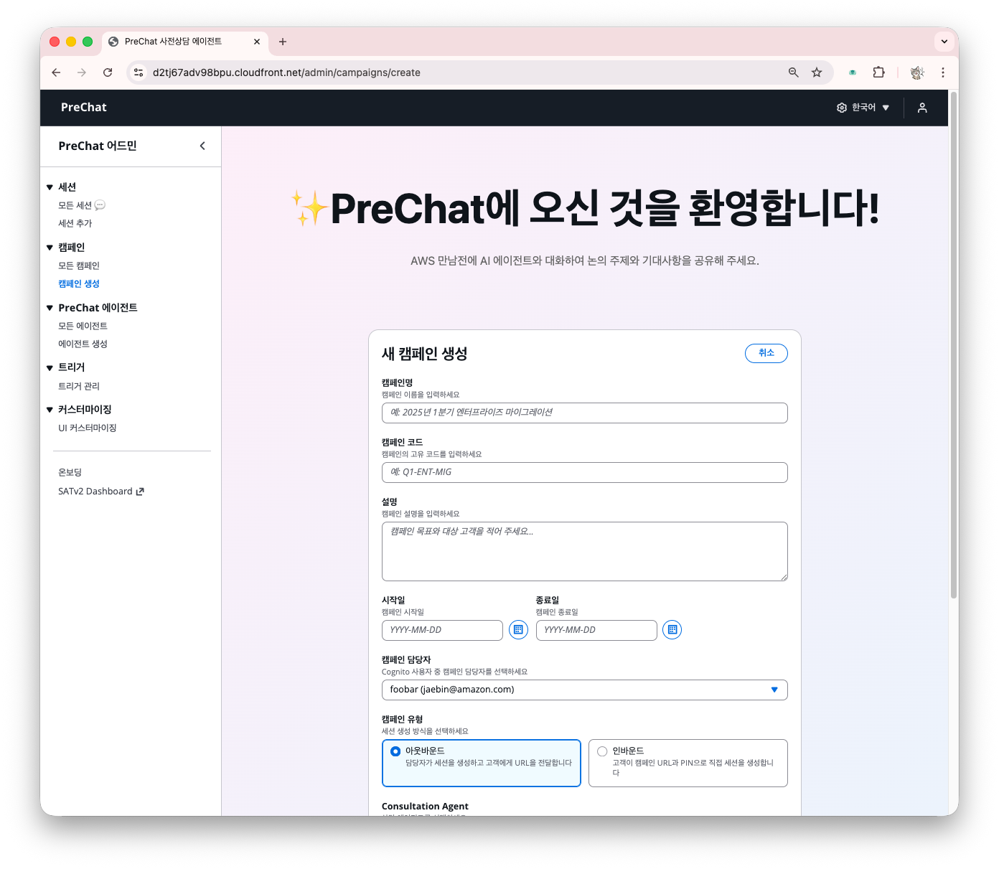
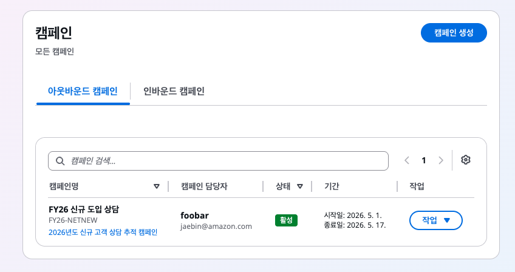
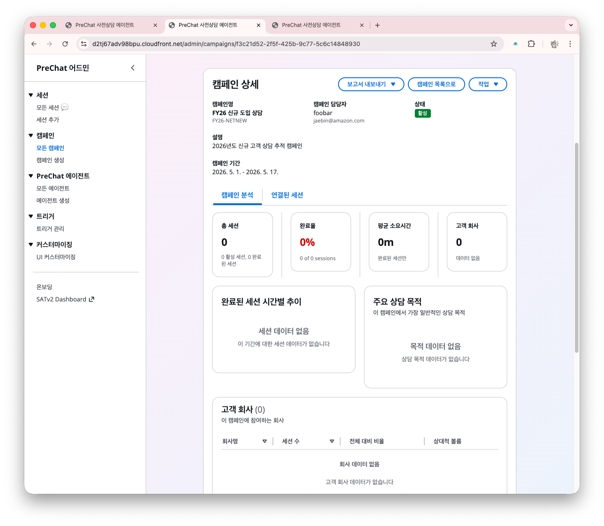
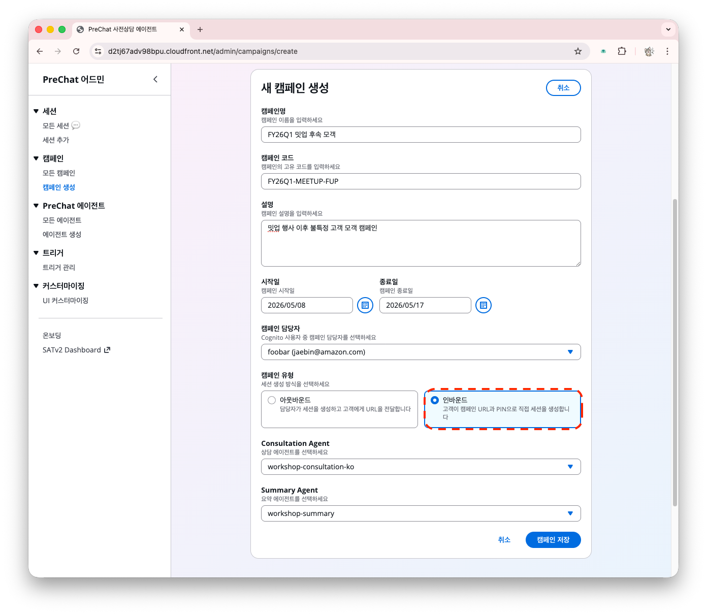
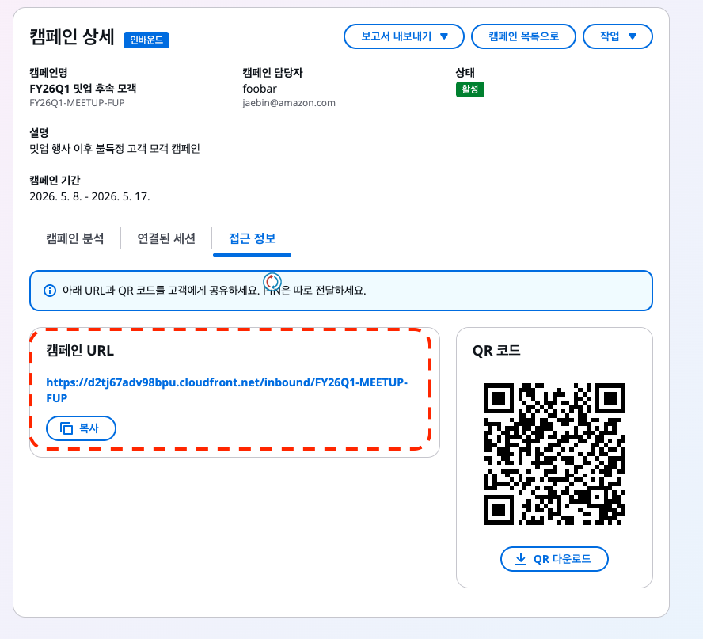

# 캠페인 만들기 — 아웃바운드와 인바운드

캠페인은 에이전트와 세션을 묶는 최상위 단위입니다. 아웃바운드와 인바운드 두 유형을 모두 생성합니다.

## 유형 선택

| 속성 | 아웃바운드 | 인바운드 |
|------|----------|---------|
| 세션 (대화방) 생성 시점 | 관리자가 생성 요청 | 고객이 URL 접근 시 자동 생성 |
| PIN 관리 | 세션마다 고유 (6자리) | 세션마다 고유 (6자리) |
| URL | 세션별 고유 | 캠페인 URL |
| 중복 방지 | 세션 단위 | 전화번호 기반 |
| 적합한 상황 | 1:1 맞춤 상담 | 대규모 접수, 셀프 신청 |

## 1. 아웃바운드 캠페인 만들기



### 캠페인 페이지로 이동

온보딩 카드 또는,

좌측 메뉴 → **캠페인** → **캠페인 생성** 클릭





### 기본 정보 입력

- **Campaign Name** — 예: `FY26 신규 도입 상담`
- **Campaign Code** — 영문 대문자+숫자, 공백 없음 (예: `FY26-NETNEW`)
- **Description** — 캠페인 목적 자유 기술
- **Campaign Type** — <font color="red">**Outbound** 선택</font>



### 에이전트 구성 연결

**Agent Configurations** 섹션에서 역할별 에이전트를 지정합니다.

| 역할 | 선택 |
|------|------|
| **상담 에이전트 (PreChat Agent)** | 앞서 만든 상담 에이전트 |
| **요약 에이전트 (Summary Agent)** | 앞서 만든 요약 에이전트 |





### 캠페인 저장

**캠페인 저장** 버튼을 누릅니다. 캠페인 목록이나 캠페인 상세를 확인할 수 있습니다.








## 2. 인바운드 캠페인 만들기



### 새 캠페인 생성

다시 캠페인 생성 화면으로 이동하세요.



### Campaign Type을 Inbound로 선택

- **Campaign Name** — 예: `FY26Q1 밋업 후속 모객`
- **Campaign Code** — 영문 대문자+숫자, 공백 없음 (예: `FY26Q1-MEETUP-FUP`)
- **Description** — 캠페인 목적 자유 기술
- **Campaign Type** — <font color="red">**Inbound** 선택</font>





### 에이전트 구성과 저장

아웃바운드와 동일하게 에이전트를 지정하고 저장합니다.



### 캠페인 URL 복사

인바운드 캠페인은 불특정 고객이 직접 접근할 수 있도록 별도 캠페인 URL (QR 코드)가 제공됩니다. 캠페인 상세에서 **접근 정보**를 확인 가능합니다.

```
https://{WebsiteURL}/inbound/{campaignCode}
```

이 URL을 세미나 참석자나 마케팅 페이지에 공유합니다.





<details>
<summary>캠페인 상태 관리</summary>

캠페인은 네 가지 상태를 가집니다.

- **활성 (Active)** — 새 세션을 받을 수 있는 상태. 캠페인 생성 시 기본값
- **완료 (Completed)** — 캠페인 목적을 달성하여 종료한 상태. 새 세션 생성이 차단되고, 기존 활성 세션은 계속 진행 가능 `CampaignClosed` 도메인 이벤트가 발생하여 연결된 트리거(Slack 알림 등)가 실행됨
- **일시정지 (Paused)** — 일시적으로 접수를 중단한 상태. 새 세션 생성이 차단되지만, 다시 활성으로 전환하면 접수 재개
- **취소 (Cancelled)** — 캠페인을 폐기한 상태. 새 세션 생성 차단. 수동으로 활성 상태로 재전환 필요

</details>

## 다음 단계

캠페인이 준비되면 실제 세션을 체험합니다.

- [아웃바운드 세션 — 개별 고객 초대](../05-session/outbound-session.md)
- [인바운드 세션 — 캠페인 URL로 자가 입장](../05-session/inbound-session.md)