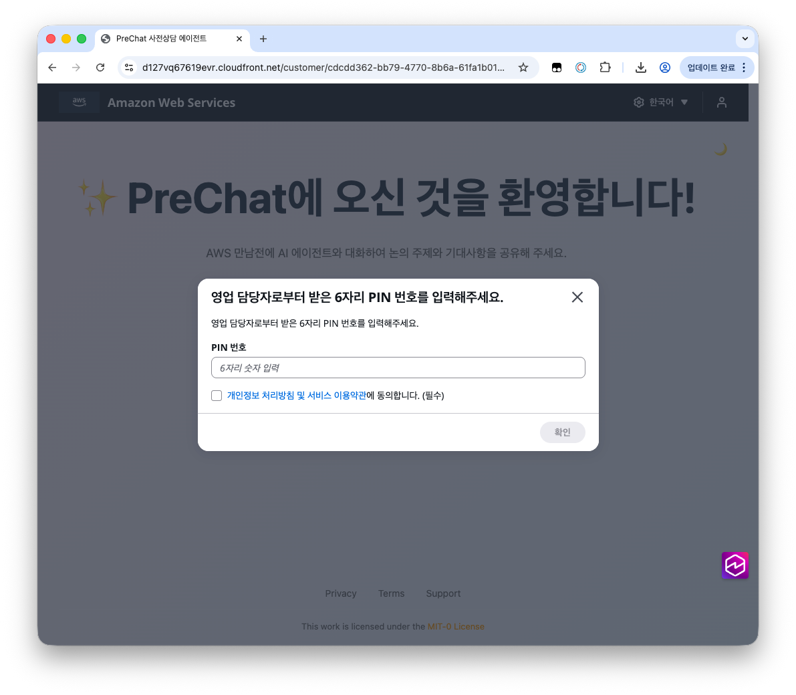
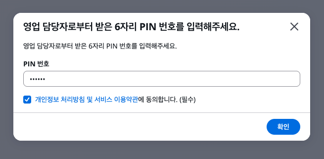
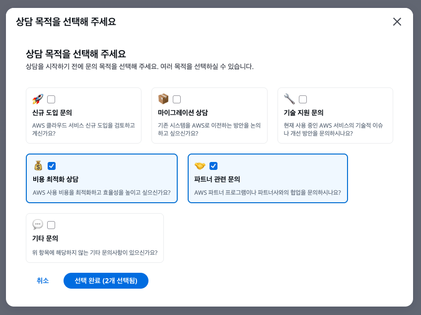
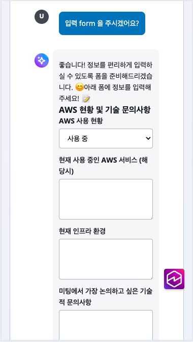
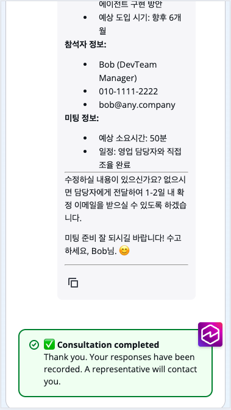
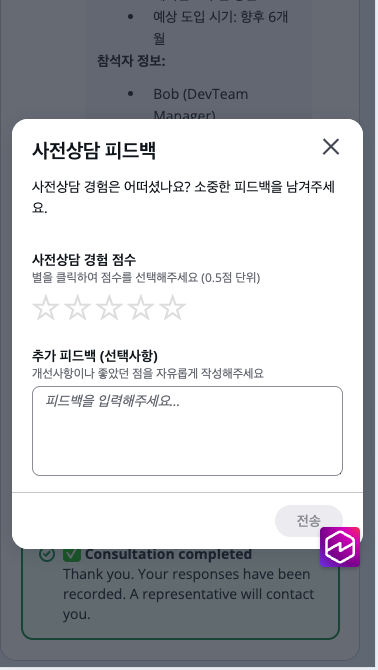

# 고객의 대화 흐름

세션 URL을 받은 고객은 아래 6단계를 거쳐 사전상담을 완료합니다. PC와 모바일 웹 브라우저 모두 지원됩니다.

## 1. 세션 URL 접속

영업 담당자가 전달한 세션 URL을 브라우저에서 엽니다. 별도 앱 설치나 회원가입 없이 바로 접속됩니다.

## 2. PIN 6자리 입력

세션 URL을 전달한 영업 담당자가 PIN 번호를 함께 공유합니다. 6자리 PIN을 입력하면 본인 확인이 완료됩니다.

## 3. 상담 목적 선택

미리 정의된 상담 목적 중 해당하는 항목을 선택합니다. 복수 선택이 가능하며, 이 정보는 에이전트가 대화 방향을 잡는 데 활용됩니다.

## 4. 에이전트와 대화

에이전트가 인사말과 함께 첫 질문을 던지면 대화가 시작됩니다. 일반적으로 6~7턴의 대화가 진행되며, 고객의 질의 내용에 따라 달라질 수 있습니다.

진술 방식이 불편하다면 에이전트가 폼(Form)을 제공할 수 있습니다. 폼에 정보를 입력하면 해당 내용이 메시지로 변환되어 대화가 이어집니다.


에이전트의 동작은 여러분이 설정한 시스템 프롬프트에 좌우됩니다. 우리가 목표하는 상담 에이전트는 실제 미팅에서 어떤 내용을 공유하고 싶은지, 현재 상황과 과제가 무엇인지를 중심으로 질문합니다. 기술적인 답변을 준비할 필요 없이 편하게 이야기하면 됩니다.


## 5. 대화 종료

정보 수집이 충분하면 에이전트가 대화 종료를 제안합니다. 고객이 직접 종료를 요청할 수도 있습니다.

대화가 종료되면 세션 상태가 **Completed**로 변경되고, 백엔드에서 AI 요약 파이프라인이 자동으로 시작됩니다.

## 6. 피드백 제출

대화 종료 후 간단한 피드백 화면이 표시됩니다. 소중한 피드백을 시스템 개선에 활용하세요.

## 세션 이어가기

브라우저를 닫았다가 같은 URL로 다시 접속하면 대화를 이어갑니다 (PIN 재인증 필요). 이전 대화 내역이 그대로 표시됩니다.

대화 품질 팁

에이전트 프롬프트에 다음을 반영하면 대화 품질이 높아집니다.

- 한 번에 하나의 질문만 던지도록 지시
- 모호한 답변에 follow-up 질문 요구
- 세션 종료 전 수집한 정보를 요약하고 확인 요청
- 기술 용어 사용 시 쉬운 설명 병기

에이전트 편집은 [에이전트 생성과 프롬프트 작성](../04-admin/create-agent.md)을 참고합니다.

## 다음 단계

대화가 종료되면 [BANT 요약과 AI 리포트](../06-postsession/ai-report.md)로 이동합니다.
