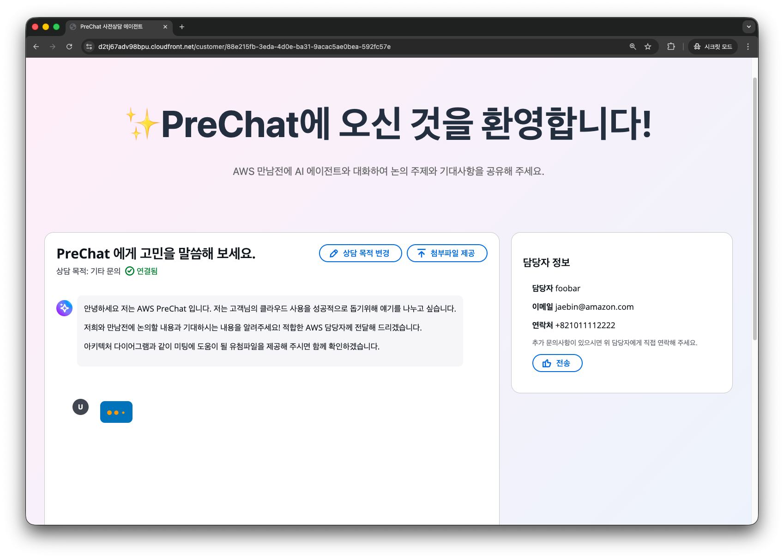
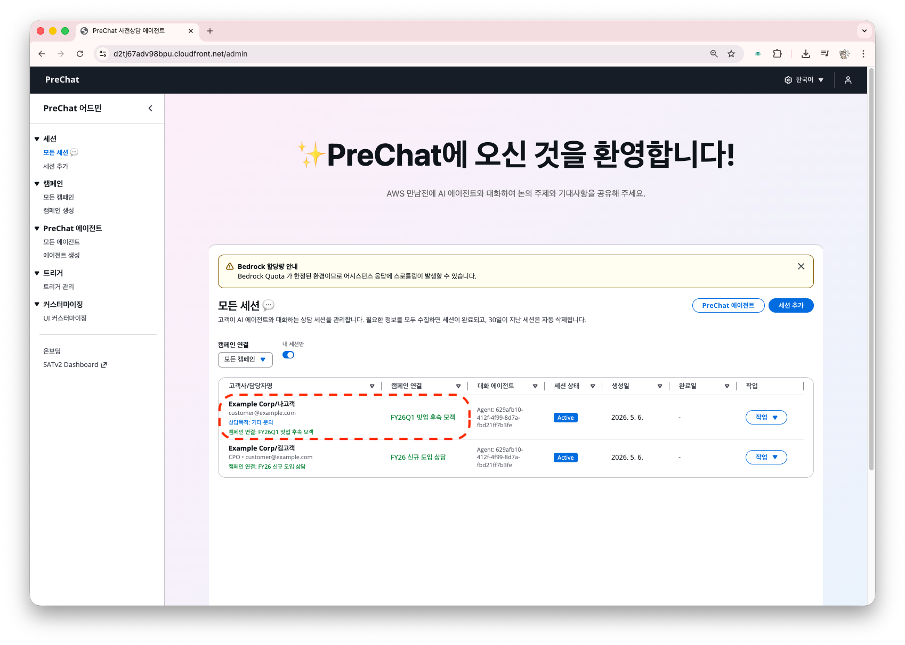

# 인바운드 세션 — 캠페인 URL로 자가 입장

고객이 URL로 직접 접근하고 정보를 입력해 세션을 스스로 생성합니다. 세미나 후속 접수, 마케팅 랜딩, 파트너 상담 등에 적합합니다.

## 사전 준비

[캠페인 만들기](../04-admin/create-campaign.md)에서 **Inbound** 유형 캠페인을 생성합니다.

## 고객 입장 체험



### 캠페인 URL 열기

새로운 브라우저 창에서 캠페인 링크를 엽니다. (모바일 QR 촬영으로 실습할 수도 있습니다.)

```
https://dxxx.cloudfront.net/inbound/FY26Q1-MEETUP-FUP
```




### 개인정보 입력

이름, 이메일, 회사명, 전화번호를 기입합니다.





### 채팅 진입

**상담 시작**을 합니다. 새 전화번호면 새 세션이 생성됩니다. 기존 번호면 기존 세션이 복원됩니다.



이 화면은 아웃바운드 고객의 상담 화면과 다르지 않습니다.



## 전화번호 기반 중복 방지

PreChat 인바운드 캠페인은 **하나의 전화번호 = 하나의 세션**으로 취급합니다.

| 상황 | 결과 |
|------|-----|
| 새 번호로 입장 | 새 세션 생성 |
| 기존 번호로 재입장 | 기존 세션 복원, 대화 이어가기 |
| 다른 캠페인에서 같은 번호 | 캠페인마다 독립된 세션 (서로 영향 없음) |

<details>
<summary>기술 참고</summary>

중복 방지는 DynamoDB GSI3 인덱스를 사용합니다(`INBOUND#{campaignId}#PHONE#{phone}`). 캠페인과 전화번호 조합으로 조회하여 기존 세션을 찾습니다.
</details>

## 세션 목록 확인

인바운드 캠페인은 관리자가 세션을 생성하지 않으며, 고객이 진입하면 자동으로 세션 리스트에 추가됩니다.



## 다음 단계

지금까지 생성한 아웃바운드/인바운드 세션에서 AI 대화를 시작해주세요. 충분히 말하고 대화를 종료하세요. 

그다음 [BANT 요약과 AI 리포트](../06-postsession/ai-report.md)로 이동합니다.

