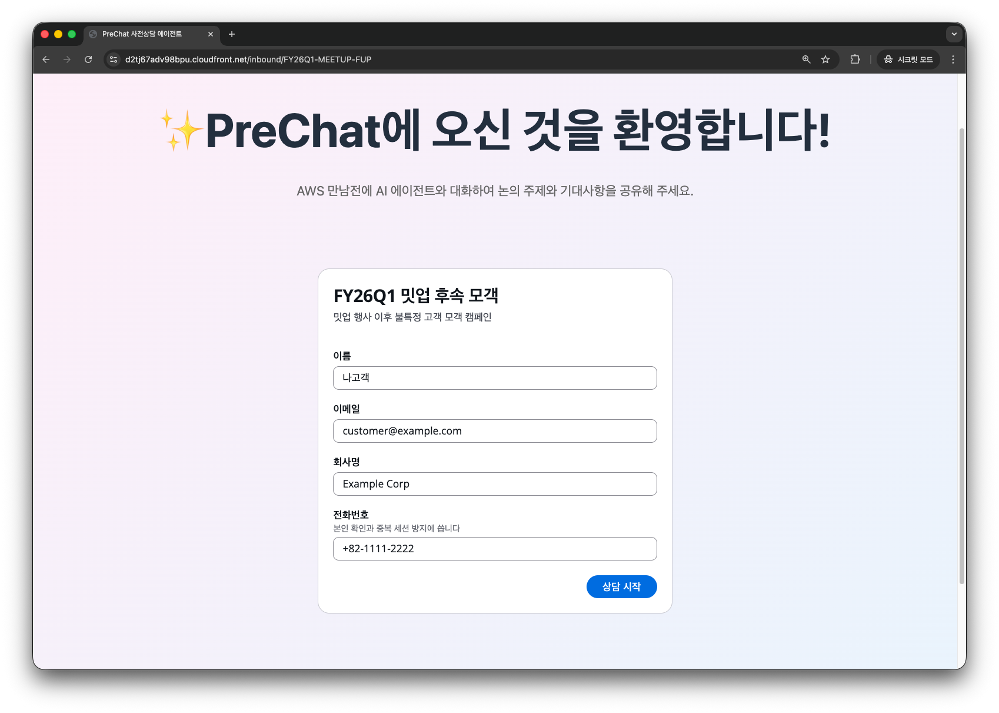
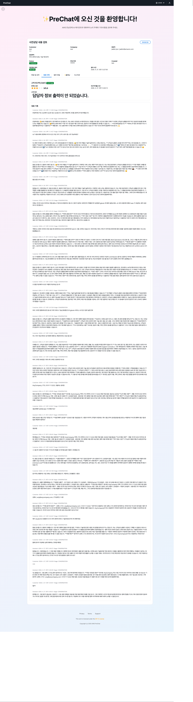
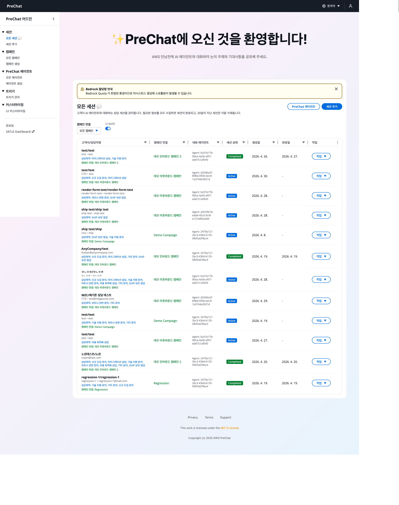

# 인바운드 세션 — 캠페인 URL로 자가 입장

고객이 URL로 직접 접근하고 정보를 입력해 세션을 스스로 생성합니다. 세미나 후속 접수, 마케팅 랜딩, 파트너 상담 등에 적합합니다.

## 사전 준비

[캠페인 만들기](../04-admin/create-campaign.md)에서 **Inbound** 유형 캠페인을 생성합니다.

- 캠페인 URL: `https://{WebsiteURL}/inbound/{campaignCode}`
- 캠페인 PIN: 생성 시 지정한 6자리 (고객에게 별도 공유)

## 고객 입장 체험



### 시크릿 브라우저에서 캠페인 URL 열기

관리자 세션과 섞이지 않도록 시크릿 창에서 엽니다.

```
https://dxxx.cloudfront.net/inbound/FY26INBOUND
```





### 캠페인 PIN 입력

공유받은 6자리 PIN을 입력합니다.





### 개인정보와 상담 동의 입력

Name, Email, Company, Phone, Consent 체크를 완료합니다.





### 세션 자동 생성 → 채팅 진입

새 전화번호면 새 세션이 생성됩니다. 기존 번호면 기존 세션이 복원됩니다.





## 전화번호 기반 중복 방지

하나의 캠페인 내에서 **하나의 전화번호 = 하나의 세션**을 보장합니다.

| 상황 | 결과 |
|------|-----|
| 새 번호로 입장 | 새 세션 생성 |
| 기존 번호로 재입장 | 기존 세션 복원, 대화 이어가기 |
| 다른 캠페인에서 같은 번호 | 캠페인마다 독립된 세션 (서로 영향 없음) |

<details>
<summary>기술 참고</summary>

중복 방지는 DynamoDB GSI3 인덱스를 사용합니다(`INBOUND#{campaignId}#PHONE#{phone}`). 캠페인과 전화번호 조합으로 조회하여 기존 세션을 찾습니다.
</details>

## 관리자 대시보드에서의 차이

인바운드 캠페인은 관리자가 세션을 생성하지 않습니다. Sessions 리스트에 나타나는 세션은 모두 고객이 직접 생성한 것입니다.



## 세션 수량 통제

- 새 세션 차단: 캠페인 **Status**를 **Inactive**로 변경
- PIN 변경: 기존 URL을 가진 고객의 신규 입장 차단 (진행 중 세션은 영향 없음)

## 에이전트 선택 우선순위

인바운드 캠페인은 세션별 에이전트 오버라이드가 불가합니다. 캠페인 `agentConfigurations.prechat` 설정이 모든 세션에 강제 적용됩니다.

## 다음 단계

세션이 시작됐다면 [고객 대화 흐름](customer-conversation.md)으로 이동합니다.

<details>
<summary>문제 해결</summary>

**"Invalid PIN"** — 캠페인 PIN을 잘못 입력했습니다. 관리자에게 정확한 PIN을 확인합니다.

**"Phone number already registered"** — 같은 캠페인 내에서 기존 세션이 있습니다. 자동으로 기존 세션이 복원됩니다. 복원 실패 시 관리자에게 기존 세션의 Inactivate 처리를 요청합니다.

**PIN 분실** — 관리자가 캠페인을 편집하여 새 PIN을 설정하고 재공유합니다.
</details>