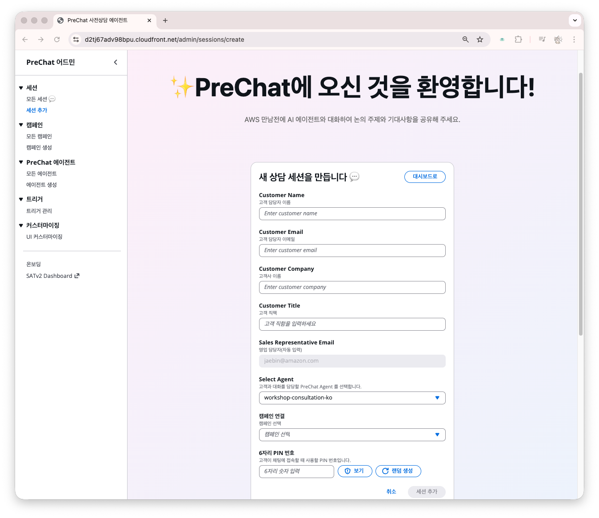
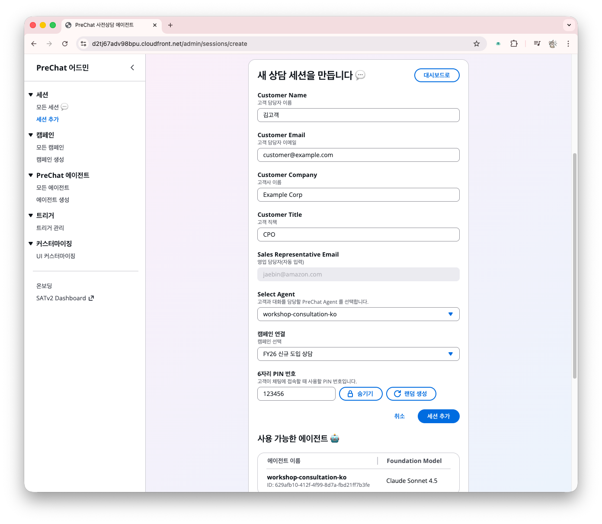
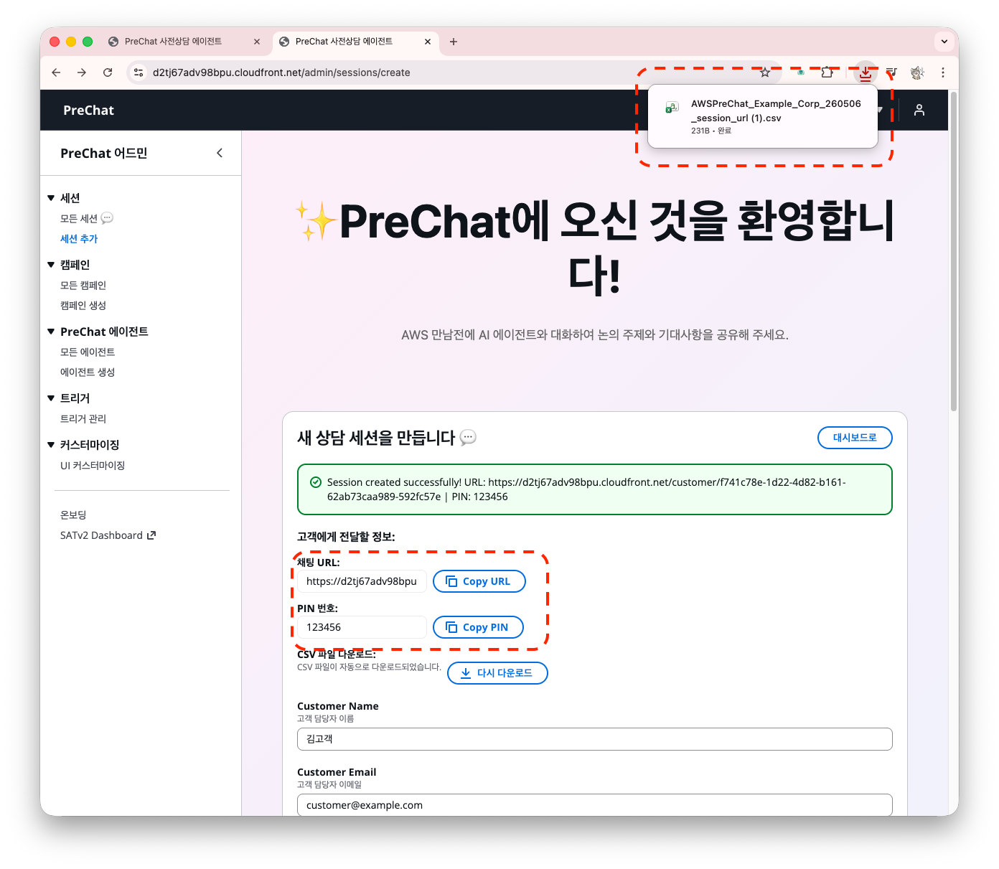
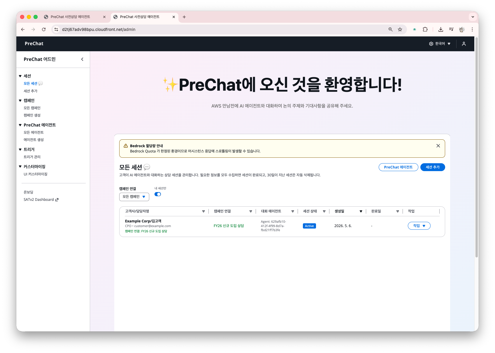
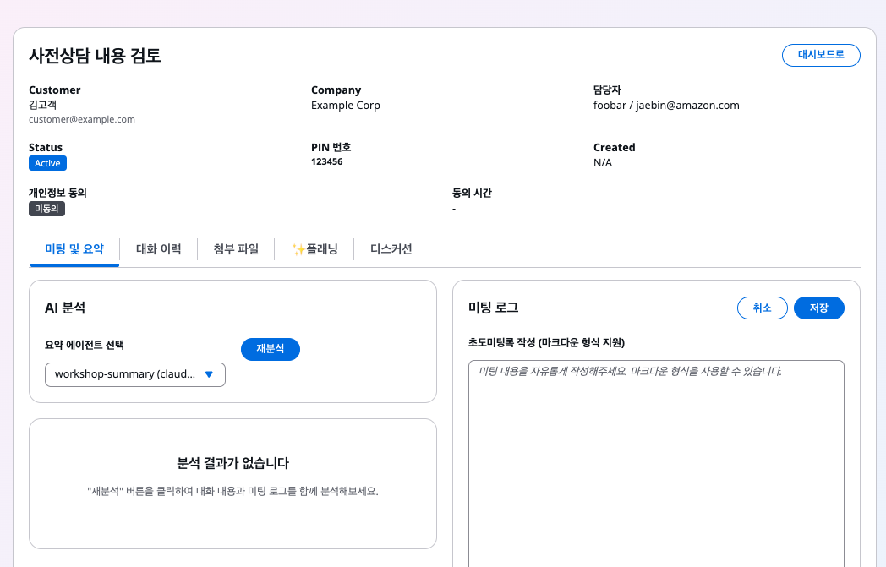
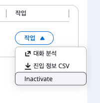

# 아웃바운드 세션 — 개별 고객 초대

관리자가 고객별로 세션을 사전 생성하고 URL과 PIN을 개별 전달합니다.

## 세션 생성



### 세션 페이지 진입

온보딩 카드 또는,

좌측 **세션** → **세션 추가** 클릭





### 캠페인 선택

**Campaign** 드롭다운에서, 이전에 만든 Outbound 캠페인 선택



### 고객 정보 입력

- **Customer Name** — 예: `김고객`
- **Customer Email** — 예: `customer@example.com`
- **Customer Company** — 예: `Example Corp`
- **Customer Title** — 예: `CPO`




### 에이전트 오버라이드 (선택)

캠페인에 설정한 상담 에이전트 또는,
이 세션만 다른 에이전트를 쓰려면 **Agent override** 드롭다운에서 선택합니다.



### PIN 번호 (선택)

6자리 PIN 번호는 랜덤 또는 직접 설정합니다.





### 세션 생성

**세션 추가** 클릭 → URL과 PIN이 표시되며, **CSV 파일** 하나가 다운로드 됩니다.





## 세션 URL과 PIN

| 항목 | 예시 |
|------|------|
| **Session URL** | `https://{WebsiteURL}/chat/{sessionId}` |
| **PIN** | `000000` (6자리) |
| **TTL** | 생성 시점 + 30일 (기본) |


  - 접속정보는 다운로드한 CSV 파일 및 세션 상세 화면에서 재확인 가능합니다.
  - 고객 대화 이력은 30일 후 자동 삭제됩니다. 이를 변경하려면 [DynamoDB Table TTL 옵션](https://docs.aws.amazon.com/ko_kr/amazondynamodb/latest/developerguide/TTL.html)을 확인합니다.


## 고객에게 전달하기

이메일, 문자 등으로 URL과 PIN을 전달합니다.

```
안녕하세요 김고객님,

ACME 솔루션즈 사전상담을 위한 전용 링크를 보내드립니다.

  상담 링크: https://dxxx.cloudfront.net/chat/sess_abc123def456
  접속 PIN: 849273

아래 항목을 미리 생각해두시면 상담이 원활합니다.
- 현재 사용 중인 솔루션
- 도입을 고려하는 배경
- 희망 도입 시기

상담은 AI 챗봇과 자유롭게 대화하는 형태로 진행되며 약 5~10분 소요됩니다.
```

## 세션 상태 확인

**Sessions** 리스트에서 모든 세션 상태를 확인합니다.



| Status | 의미 |
|--------|-----|
| `Created` | 생성됨, 고객이 아직 접근하지 않음 |
| `Active` | 고객이 PIN 인증 성공, 대화 진행 중 |
| `Completed` | 대화 종료, AI 리포트 생성 중/완료 |
| `Inactive` | 관리자가 수동 비활성화 |

## 세션 상세 화면

세션 항목 우측에서 **작업> 대화 분석** 을 눌러 상세 화면에 이동할 수 있습니다.

이 화면에서 고객 대화와 첨부 파일 내용 등을 확인하며 AI 도움을 받아 미팅을 준비할 수 있습니다.

| 탭 | 내용 |
|----|------|
| **미팅 및 요약** | BANT 분석 요약 (세션 종료 후 생성), 미팅록 입력 (수동 작성) |
| **대화 이력** | 고객과 AI의 전체 대화 로그 |
| **첨부 파일** | 고객이 업로드한 파일 |
| **플래닝** | AI 에이전트와 전략 상담 |
| **디스커션** | 다른 유저와 의견 공유 |



## 세션 수동 종료

고객이 명시적으로 종료하지 않은 경우, 세션 상세에서 **Inactivate** 버튼을 클릭합니다. 종료 시 AI 요약 파이프라인이 자동 시작됩니다.



## 다음 단계

세션이 생성됐다면 [고객의 대화 흐름](customer-conversation.md)으로 이동합니다.