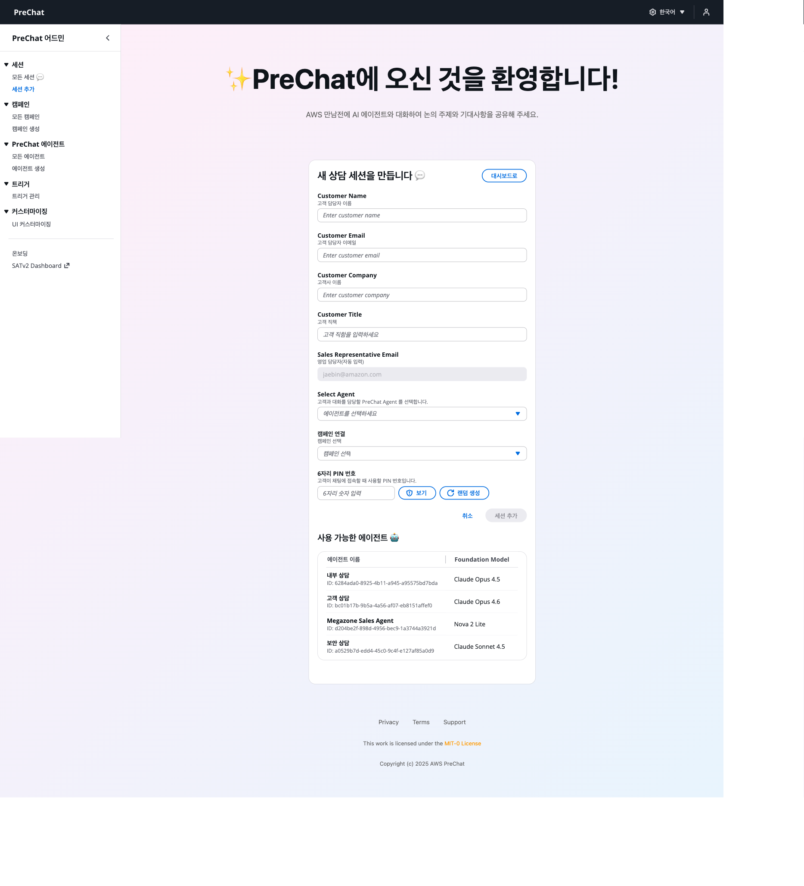
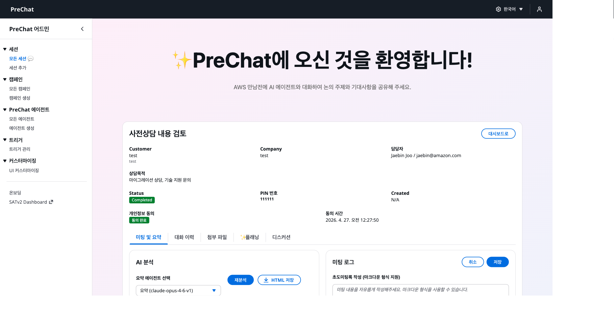

# 아웃바운드 세션 — 개별 고객 초대

관리자가 고객별로 세션을 사전 생성하고 URL과 PIN을 개별 전달합니다.

## 세션 생성



### 세션 페이지 진입

좌측 **Sessions** → **Create Session** 클릭





### 캠페인 선택

**Campaign** 드롭다운에서 Outbound 캠페인 선택





### 고객 정보 입력

- **Customer Name** — 예: `김고객`
- **Customer Email** — 예: `customer@example.com`
- **Customer Company** — 예: `Example Corp`
- **Customer Phone** — 예: `+821098765432`

필수: Name, Email. 나머지는 선택입니다.





### 에이전트 오버라이드 (선택)

이 세션만 다른 에이전트를 쓰려면 **Agent override** 드롭다운에서 선택. 비워 두면 캠페인 기본 에이전트 사용.





### 세션 생성

**Create** 클릭 → URL과 PIN이 표시됩니다.





## 세션 URL과 PIN

| 항목 | 예시 |
|------|------|
| **Session URL** | `https://{WebsiteURL}/chat/{sessionId}` |
| **PIN** | `849273` (6자리) |
| **TTL** | 생성 시점 + 30일 (기본) |


PIN은 화면에 한 번만 표시됩니다. 외부 전달 전에 정확하게 복사했는지 확인합니다.


## 고객에게 전달하기

이메일, 슬랙, 문자 등으로 URL과 PIN을 전달합니다.

```
안녕하세요 김고객님,

ACME 솔루션즈 사전상담을 위한 전용 링크를 보내드립니다.

  상담 링크: https://dxxx.cloudfront.net/chat/sess_abc123def456
  접속 PIN: 849273

아래 항목을 미리 생각해두시면 상담이 원활합니다.
- 현재 사용 중인 솔루션
- 도입을 고려하는 배경
- 희망 도입 시기

상담은 AI 챗봇과 자유롭게 대화하는 형태로 진행되며 약 15~20분 소요됩니다.
```

## 세션 상태 추적

**Sessions** 리스트에서 모든 세션 상태를 확인합니다.


| Status | 의미 |
|--------|-----|
| `Created` | 생성됨, 고객이 아직 접근하지 않음 |
| `Active` | 고객이 PIN 인증 성공, 대화 진행 중 |
| `Completed` | 대화 종료, AI 리포트 생성 중/완료 |
| `Inactive` | 관리자가 수동 비활성화 |

## 세션 상세 화면

세션 클릭 시 상세 탭이 열립니다.

| 탭 | 내용 |
|----|------|
| **Info** | 고객 정보, 상태, PIN, URL |
| **Messages** | 고객과 AI의 전체 대화 로그 |
| **AI Report** | BANT 분석 요약 (세션 종료 후 생성) |
| **Meeting Plan** | 미팅 준비 플랜 (세션 종료 후 생성) |
| **Meeting Log** | 본 미팅의 기록 (수동 작성) |



## 세션 수동 종료

고객이 명시적으로 종료하지 않은 경우, 세션 상세에서 **Inactivate** 버튼을 클릭합니다. 종료 시 AI 요약 파이프라인이 자동 시작됩니다.


## 다음 단계

세션이 생성됐다면 [고객 대화 흐름](customer-conversation.md)으로 이동합니다.