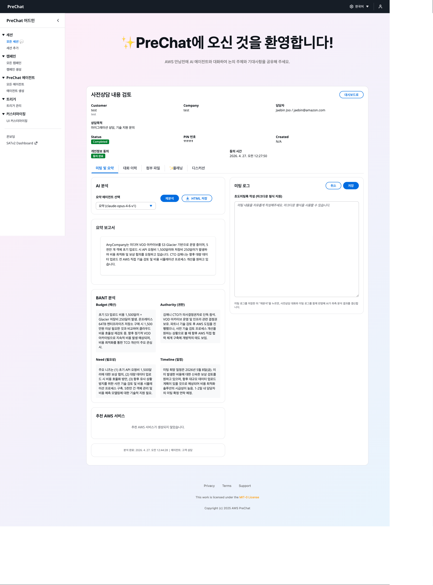
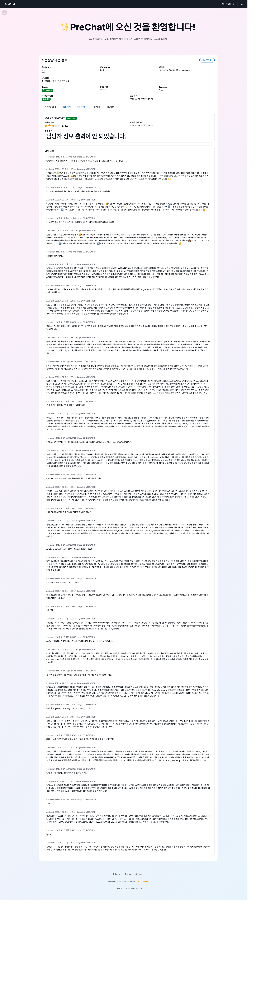

# BANT 요약과 AI 리포트

세션이 Completed 상태로 전환되면 **요약 에이전트**가 대화 로그 전체를 읽고 BANT 프레임워크에 따라 리포트를 자동 생성합니다.

## BANT란

| 항목 | 설명 |
|------|-----|
| **Budget** | 고객이 집행 가능한 예산 규모와 의사결정 여부 |
| **Authority** | 의사결정 권한자와 프로세스 |
| **Need** | 해결해야 할 문제와 비즈니스 동기 |
| **Timeline** | 도입 희망 시기와 주요 마일스톤 |

요약 에이전트는 Pydantic 기반 Structured Output으로 타입 안전한 응답을 반환하며, 화면에는 사람이 읽기 좋은 마크다운 리포트로 렌더링됩니다.

## 리포트 확인



### 세션 상세 페이지로 이동

대시보드 → **Sessions** → 해당 세션 클릭



### AI Report 탭을 연다

세션이 Completed 상태라면 자동 생성된 리포트가 표시됩니다. 상태가 `Generating`이면 잠시 기다린 뒤 새로고침합니다.





## 리포트 구성



생성된 리포트는 다음 섹션으로 구성됩니다.

### 1. Markdown Summary

대화 전체를 한두 단락으로 요약한 서술형 문단입니다. 본 미팅 참석자가 5분 안에 파악할 수 있도록 작성됩니다.

### 2. BANT Analysis

네 항목을 각각 요약하고 누락된 정보를 표시합니다.

```
Budget
  - 파악됨: 연간 예산 5억원 수준 언급
  - 누락: 구체적 승인 단계, 예비비 범위

Authority
  - 파악됨: IT 본부장(김담당) 최종 결정
  - 누락: CFO 승인 필요 여부

Need
  - 핵심 과제: 온프레미스 ERP 라이선스 비용 절감
  - 배경: 2027년 라이선스 갱신 예정, 매년 20% 인상
  - 우선순위: 비용 > 성능 > 운영 편의

Timeline
  - 의사결정: 2026 Q3까지
  - PoC: 2026 Q4
  - Go-Live: 2027 Q2
```

### 3. AWS Services 추천

대화 맥락을 기반으로 요약 에이전트가 관련 AWS 서비스를 추천합니다.

| 서비스 | 이유 |
|--------|-----|
| Aurora PostgreSQL | Oracle 대체, 라이선스 비용 절감 |
| DMS | 이관 도구 |
| CloudWatch | 운영 모니터링 |

## 리포트 재생성

대화 로그를 수정하지 않는 한 리포트는 한 번 생성되면 재사용됩니다. 강제로 재생성하려면 **Regenerate Report** 버튼을 누릅니다.



요약 에이전트는 호출당 Bedrock 모델 사용료가 발생합니다. 꼭 필요할 때만 재생성하세요.


## 리포트 내보내기

리포트를 PDF 또는 마크다운으로 내보내 외부 공유할 수 있습니다.

- **Copy to Clipboard** — 마크다운 원문 복사
- **Download PDF** — 브라우저 인쇄 → PDF 저장

## 여러 세션 비교하기

캠페인 분석 대시보드에서 여러 세션의 BANT 요약을 한눈에 비교할 수 있습니다. [캠페인 대시보드](../07-analytics/campaign-dashboard.md) 참고.

## 리포트 품질 개선 팁

리포트 품질이 기대에 못 미친다면 다음을 점검합니다.



에이전트 프롬프트에 **"각 BANT 항목을 충분히 파악할 때까지 질문을 계속하라"**는 지시를 추가합니다.



요약 에이전트의 모델을 Claude Sonnet 4 또는 Claude 3.5 Sonnet 같은 고품질 모델로 교체합니다. 모델 변경은 에이전트 설정에서 가능하며 재배포는 필요하지 않습니다.



대화는 한국어인데 리포트가 영어로 나오는 경우, 에이전트 `locale` 설정을 `ko`로 지정합니다.



## 다음 단계

[미팅 플랜 생성과 활용](meeting-plan.md)으로 이동합니다.
