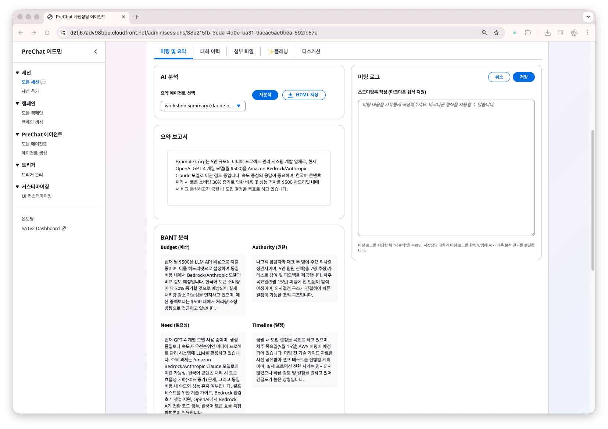
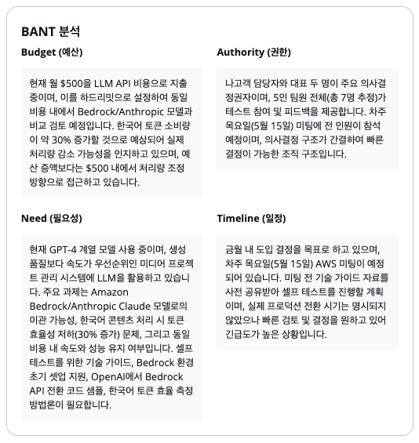
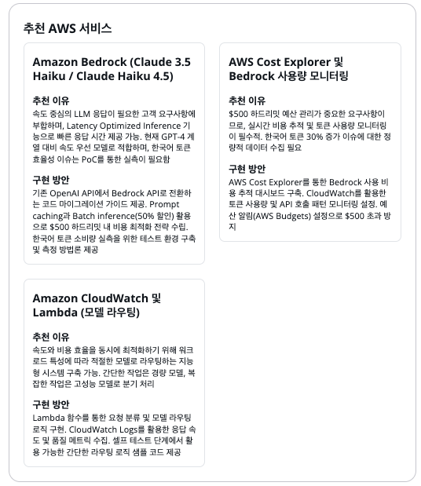

# BANT 요약과 AI 리포트

세션이 종료되면 AI가 대화 내용을 분석하여 BANT 리포트를 자동 생성합니다. 별도 작업 없이 1~2분 내에 준비됩니다.

## BANT란

영업에서 고객의 구매 준비도를 평가하는 프레임워크입니다.

| 항목 | 파악하는 것 |
|------|-----------|
| **Budget** | 예산 규모, 집행 가능 여부 |
| **Authority** | 의사결정 권한자, 승인 프로세스 |
| **Need** | 해결해야 할 문제, 비즈니스 동기 |
| **Timeline** | 도입 희망 시기, 주요 마일스톤 |

## 리포트 확인



### 세션 상세 → 미팅 및 요약 탭

> 상태가 `Generating`이면 잠시 기다린 뒤 새로고침합니다.





## 리포트 구성

### 1. Markdown Summary

대화 전체를 한두 단락으로 요약한 서술형 문단입니다.

### 2. BANT Analysis

네 항목을 각각 요약하고 누락된 정보를 표시합니다.

```
Budget
  - 파악됨: 연간 예산 5억원 수준 언급
  - 누락: 구체적 승인 단계, 예비비 범위

Authority
  - 파악됨: IT 본부장(김담당) 최종 결정
  - 누락: CFO 승인 필요 여부

Need
  - 핵심 과제: 온프레미스 ERP 라이선스 비용 절감
  - 배경: 2027년 라이선스 갱신 예정, 매년 20% 인상
  - 우선순위: 비용 > 성능 > 운영 편의

Timeline
  - 의사결정: 2026 Q3까지
  - PoC: 2026 Q4
  - Go-Live: 2027 Q2
```



### 3. AWS Services 추천

> PreChat은 AWS 솔루션 상담을 전제로 제작되었습니다.



## 리포트 재생성

**Regenerate Report** 버튼을 클릭하면 리포트를 다시 생성합니다. 이때, 우측에 기입한 미팅 로그 내용을 함께 활용합니다.

<details>
<summary>리포트 품질 개선 팁</summary>

**대화가 짧은 경우** — Summary Agent 소스코드에서 에이전트 프롬프트에 "각 BANT 항목을 충분히 파악할 때까지 질문을 계속하라"는 지시를 추가합니다.

**모델 품질** — 요약 에이전트의 모델을 더 높은 등급으로 교체하면 분석 품질이 올라갑니다. 에이전트 설정에서 변경 가능하며 재배포는 불필요합니다.
</details>

## 다음 단계

[미팅 플랜 생성과 활용](meeting-plan.md)으로 이동합니다.