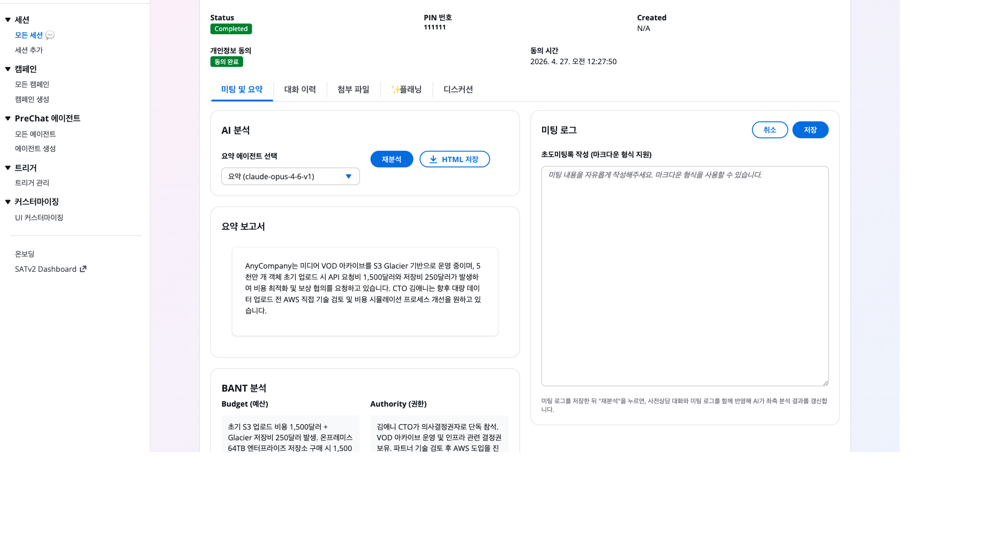

# 미팅 로그 기록

본 미팅이 끝나면 결과를 **Meeting Log**에 기록합니다. 이후 분석과 후속 영업 활동의 근거가 됩니다.

## 로그 작성



### 세션 상세 → Meeting Log 탭 → "Create Meeting Log" 클릭





### 기본 필드 입력

- **Meeting Date** — 미팅 진행 일시
- **Participants** — 고객 측과 자사 측 참석자
- **Outcome** — 핵심 결과 요약 (2~3문장)
- **Next Action** — 다음 행동, 담당자, 기한
- **Notes** — 자유 메모





### 저장

세션 상태와 캠페인 메트릭에 반영됩니다.



## 템플릿 예시

```markdown
## Meeting Outcome

- 2027 Q2 Go-Live 일정 확정
- Aurora PostgreSQL 기반 PoC 진행 합의 (2026 Q4)
- IT 본부장 김담당이 주 의사결정자로 확정
- 예산은 연간 3억원 확보, CFO 승인 완료 상태

## Next Action

| # | 액션 | 담당 | 기한 |
|---|------|------|------|
| 1 | PoC 제안서 초안 작성 | SA 박엔지니어 | 2026-05-15 |
| 2 | 라이선스 TCO 분석 | AM 이세일 | 2026-05-20 |
| 3 | 클라우드 보안 리뷰 요청 | 고객 보안팀 | 2026-05-25 |

## Key Quotes

> "라이선스 비용 절감이 되기만 하면 이관 방식은 우리가 협의해서 맞출 수 있어요." — 김담당, IT 본부장

## Risks and Concerns

- 레거시 ERP와 연동된 15개 주변 시스템의 호환성 검증 필요
- 보안팀의 클라우드 정책 리뷰 일정이 불투명
```

## 요약 에이전트 활용

로그 작성 중 요약 에이전트 채팅 창을 열어두면 참고 자료를 즉석에서 찾을 수 있습니다.

```
관리자: 유사한 이관 일정으로 진행한 사례 있어?

요약 에이전트: KB에서 검색한 결과 다음 사례가 있습니다.

  - xyz-corp: 2024 Q3 PoC → 2025 Q1 Production 이관 (6개월)
  - abc-inc: 2023 Q4 PoC → 2024 Q2 Production (9개월, 보안 리뷰로 지연)

  고객이 제시한 2027 Q2 Go-Live는 xyz-corp과 유사한 템포입니다.
```

## 로그 편집

로그는 생성 후에도 편집 가능합니다. 편집 이력은 `updatedAt` 타임스탬프에 반영됩니다.

## 다음 단계

[캠페인 대시보드](../07-analytics/campaign-dashboard.md)로 이동합니다.