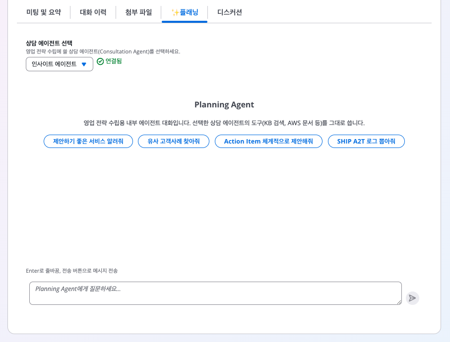
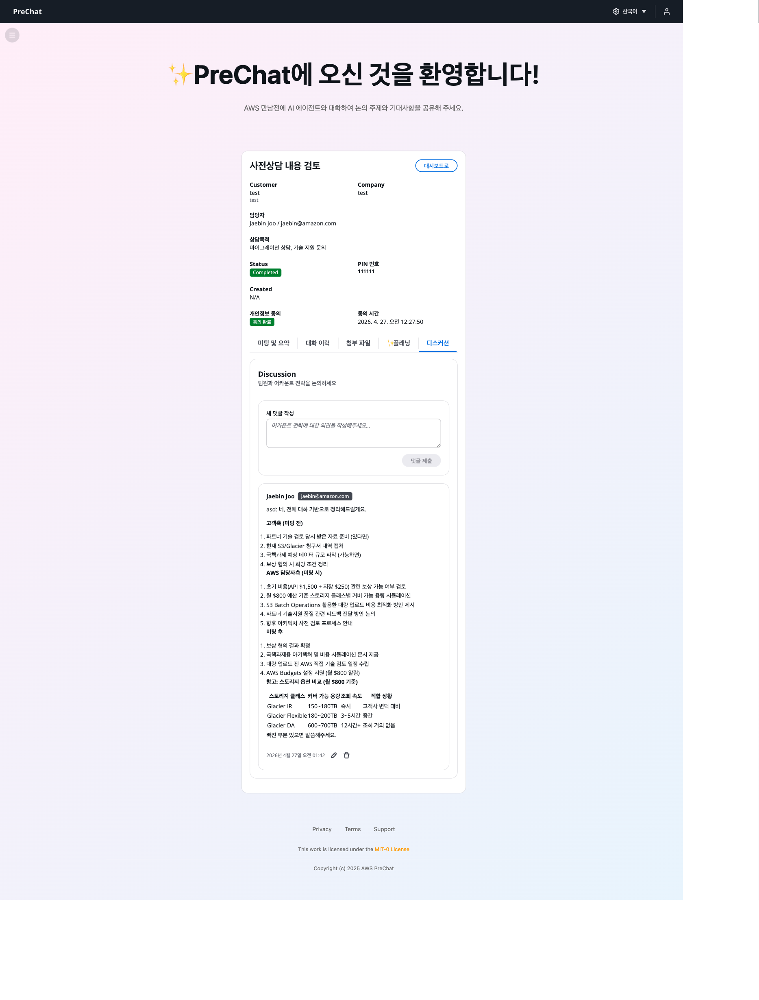

# 미팅 플랜 생성과 활용

**요약 에이전트**는 BANT 요약에 이어 본 미팅을 준비할 수 있는 플랜을 자동 생성합니다. 유사 고객 사례, AWS 문서 레퍼런스, 토의 주제, 다음 행동을 제공합니다.

## 플랜 구성



| 섹션 | 내용 |
|------|------|
| **Objectives** | 이번 미팅의 목표 (BANT 기반) |
| **Talking Points** | 핵심 토의 주제와 예상 질문 |
| **References** | Bedrock Knowledge Base에서 검색한 유사 사례, AWS 공식 문서 |
| **Proposed Agenda** | 제안 타임라인 (예: 60분 미팅 기준) |
| **Next Steps** | 미팅 후 후속 조치 |
| **Comments** | 관리자 팀원이 자유롭게 덧붙이는 메모 |

## 플랜 확인



### 세션 상세 → Meeting Plan 탭

세션이 Completed 상태이고 AI Report가 생성된 뒤 약 1~2분 내에 플랜이 준비됩니다.





### References 클릭하여 근거 확인

각 레퍼런스는 링크로 제공됩니다.

- KB 레퍼런스: 사내 Knowledge Base에 등록한 사례 문서
- AWS Docs: `docs.aws.amazon.com` 공식 페이지





### Comments에 팀원 의견 추가

본 미팅 참석자들이 플랜에 코멘트를 남길 수 있습니다. CSR이 영업 관점, SA가 기술 관점의 메모를 추가합니다.





## 요약 에이전트와 채팅하기

요약 에이전트는 세션 이후에도 **Sales Rep과 대화**할 수 있습니다. 미팅 준비 중 추가 질문이 있을 때 활용합니다.


### 활용 예시

```
관리자: 이 고객은 이미 Snowflake를 사용하고 있어. AWS로 데이터 웨어하우스를
        이관하는 제안을 할 때 주의할 점이 뭐야?

Planning Agent: Snowflake를 쓰는 고객에 Redshift 이관을 제안할 때 주로 다음 포인트를
                강조합니다.

                1. 데이터 이관 도구 (AWS DMS, Snowflake Unload + Redshift Copy)
                2. Snowflake 특유의 기능(Time Travel, Data Sharing)의 Redshift 대응
                   (Redshift Serverless, Redshift Data Sharing)
                3. 비용 구조 차이 ...

                유사 사례로 KB에서 "xyz-corp-migration.pdf"를 참고하세요.
```

요약 에이전트는 대화 중 다음 도구를 사용합니다.

- **retrieve** — KB에서 유사 사례 검색
- **aws_docs_mcp** — AWS 공식 문서 실시간 조회
- **extract_a2t_log** — 세션 원본 대화 로그 참조
- **http_request** — 필요 시 외부 자료 조회

## 플랜 편집

자동 생성된 플랜 섹션은 **편집 가능**합니다.



### 섹션의 Edit 아이콘 클릭

마크다운 에디터가 열립니다.





### 내용을 수정하고 저장

저장하면 팀원들이 보는 플랜도 즉시 반영됩니다.



## 플랜 내보내기

미팅 참석자에게 공유할 수 있도록 내보낼 수 있습니다.

- **Copy Markdown** — 슬랙/노션에 바로 붙여넣기
- **Download PDF** — 인쇄 친화적 포맷

## 팀 협업 시나리오



### CSR이 초안을 검토하고 참여자를 확정한다

플랜의 Agenda를 본 뒤 내부 슬랙으로 본 미팅 참석 요청을 돌립니다.



### SA가 기술 주제를 추가한다

Comments와 Talking Points에 기술 깊이의 질문을 추가합니다.



### 영업 담당자가 상업 조건 맥락을 보탠다

가격, 계약 조건 관련 메모를 코멘트로 남깁니다.



### 본 미팅 진행 중 실시간 참조

미팅 중 화면 공유로 플랜을 띄우고 진행 상황을 따라갑니다.



## 다음 단계

[미팅 로그 기록](meeting-log.md)으로 이동합니다.
