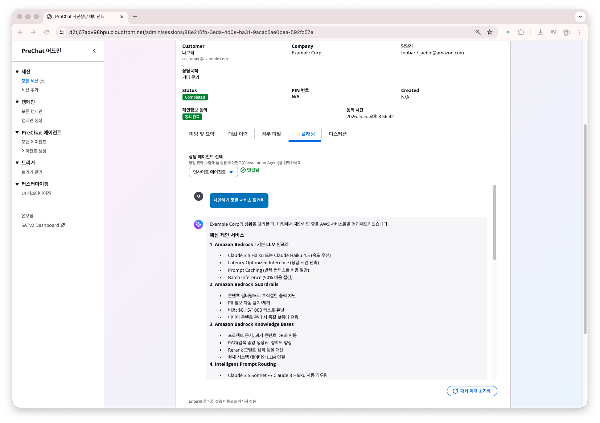

# 미팅 플랜 생성과 활용

세션 상세 페이지의 **✨플래닝** 탭은 AI와 대화하며 본 미팅을 준비하는 공간입니다. 

BANT 리포트를 읽은 뒤 이 탭에서 구체적인 미팅 전략을 세웁니다.

## 플래닝 탭 열기

세션 상세 → **✨플래닝** 탭을 클릭합니다.


## 사용 방법



### 에이전트 선택

상단 드롭다운에서 상담 에이전트를 선택합니다.

**일반적으로 고객 용도와 내부 용도로 상담 에이전트를 나눠 사용해야 합니다.** 이 에이전트가 세션의 대화 내용을 참고하여 미팅 준비를 돕도록 구성해야 합니다.



### 추천 질문 또는 직접 입력

처음 열면 추천 질문 4개가 표시됩니다. 클릭하면 바로 질문이 전송됩니다.

| 추천 질문 | 활용 상황 |
|----------|----------|
| 제안하기 좋은 서비스 알려줘 | 고객 니즈에 맞는 서비스 추천이 필요할 때 |
| 유사 고객사례 찾아줘 | 레퍼런스를 준비할 때 |
| Action Item 체계적으로 제안해줘 | 미팅 후 후속 조치를 미리 정리할 때 |
| SHIP A2T 로그 뽑아줘 | 보안 점검 결과를 정리할 때 |

직접 자유롭게 질문을 입력해도 됩니다.



### AI 응답 확인

AI가 세션의 대화 내용과 Knowledge Base를 참고하여 답변합니다. 응답은 실시간 스트리밍으로 표시됩니다.



### 대화를 이어가며 플랜 구체화

한 번의 질문으로 끝내지 않아도 됩니다. 후속 질문을 이어가며 미팅 아젠다, 예상 질문, 제안 전략 등을 구체화합니다.



## 활용 예시

```
나: 이 고객에게 제안하기 좋은 서비스 알려줘

AI: 대화 내용을 분석한 결과, 고객은 온프레미스 ERP 라이선스 비용 절감을
    핵심 과제로 언급했습니다. 다음 서비스를 중심으로 제안하면 좋겠습니다.

    1. Aurora PostgreSQL — Oracle 대체, 라이선스 비용 제거
    2. DMS — 무중단 데이터 이관
    3. CloudWatch — 이관 후 운영 모니터링

    미팅에서는 TCO 비교 자료를 준비하면 설득력이 높아집니다.

나: 유사한 이관 사례 있어?

AI: KB에서 검색한 결과 다음 사례가 있습니다.
    - A사: Oracle → Aurora 이관, 6개월 소요, 연간 40% 비용 절감
    - B사: ERP 전체 이관, 9개월 소요 (보안 리뷰로 지연)
    고객이 제시한 2027 Q2 Go-Live는 A사와 유사한 일정입니다.
```



## 대화 이력

플래닝 탭의 대화 이력은 브라우저에 저장됩니다. 같은 브라우저에서 다시 열면 이전 대화가 그대로 표시됩니다.


대화 이력은 브라우저 로컬 저장소에 보관됩니다. 다른 기기나 브라우저에서는 보이지 않습니다.


## 토론 탭과의 차이

| 항목 | ✨플래닝 탭 | 토론 탭 |
|------|-----------|--------|
| 대화 상대 | AI | 팀원 (사람) |
| 용도 | 미팅 전략 수립, 서비스 추천, 사례 검색 | 팀원 간 의견 교환, 코멘트 |
| 저장 위치 | 브라우저 로컬 | 서버 (모든 팀원 공유) |

## 다음 단계

[캠페인 대시보드](../07-analytics/campaign-dashboard.md)로 이동합니다.
