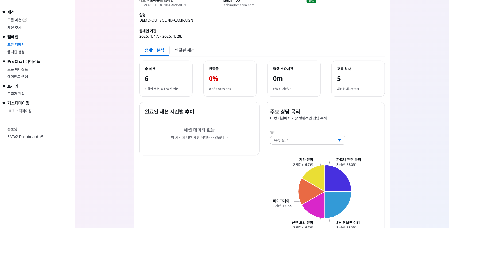
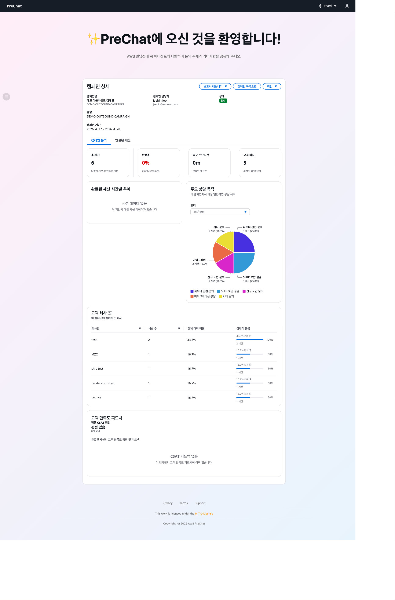

# 캠페인 대시보드

캠페인 대시보드는 특정 캠페인의 전체 세션을 집계해 트렌드와 패턴을 보여줍니다. 마케팅 성과 검토와 ICP(Ideal Customer Profile) 분석에 활용합니다.

## 진입 방법



### 캠페인 리스트에서 해당 캠페인 클릭



### 상단 탭에서 Analytics 선택

기본 탭은 Info, Sessions, Analytics, Settings 순서입니다.





## 주요 지표 카드


| 카드 | 설명 |
|------|------|
| Total Sessions | 생성된 전체 세션 수 |
| Active Sessions | 현재 진행 중인 세션 수 |
| Completed Sessions | 정상 종료된 세션 수 |
| Completion Rate | 완료율 (Completed / Total × 100) |
| Avg. Messages / Session | 세션당 평균 메시지 수 |
| Avg. CSAT | 평균 피드백 점수 (1~5) |

## 세션 추이 차트

시간대별 세션 생성/완료 추이를 라인 차트로 보여줍니다.





기본 뷰. 최근 30일의 일별 세션 수를 표시합니다.



장기 트렌드 확인용. 캠페인 기간이 긴 경우 유용합니다.



하루 중 고객이 많이 접근하는 시간을 파악합니다. 인바운드 캠페인에서 특히 유용합니다.



## 상담 목적 분포

고객이 대화 초반에 선택한 Consultation Purpose를 집계하여 도넛 차트로 표시합니다.


| 목적 예시 | 의미 |
|---------|-----|
| New Adoption | 신규 도입 상담 |
| Cost Optimization | 비용 최적화 |
| Migration | 마이그레이션 |
| Training | 학습/교육 |
| Other | 기타 |

목적 옵션은 에이전트 프롬프트에서 정의하거나 캠페인 설정에서 커스터마이즈할 수 있습니다.

## BANT 파악률

BANT 네 항목별로 "파악됨/누락" 비율을 막대 그래프로 표시합니다. 어떤 항목에서 대화가 충분히 진행되지 못하는지 파악할 수 있습니다.


## CSAT 분포

피드백 점수(1~5)의 분포와 평균을 표시합니다. 점수 하락 추세는 에이전트 프롬프트나 대화 흐름 개선이 필요하다는 신호입니다.


## AWS Services 언급 빈도

대화 중 언급되거나 Summary Agent가 추천한 AWS 서비스의 빈도를 워드 클라우드 또는 막대 그래프로 표시합니다. 고객 관심 서비스 트렌드를 읽을 수 있습니다.


## 필터와 드릴다운


대시보드 상단에서 다음 필터를 적용할 수 있습니다.

- **기간** — 최근 7일, 30일, 90일, 사용자 정의
- **상태** — Completed만 / 전체
- **CSAT** — 특정 점수 이상
- **상담 목적** — 특정 목적만

차트의 데이터 포인트를 클릭하면 해당 세션 목록으로 드릴다운됩니다.

## 데이터 내보내기

CSV로 내보내려면 우측 상단 **Export** 버튼을 누릅니다. 현재 적용된 필터를 기준으로 다음 필드가 포함됩니다.

```
sessionId, customerName, company, status, purpose,
messageCount, csat, createdAt, completedAt
```

## 원시 데이터 접근

대시보드 외에 원시 데이터가 필요하면 다음 경로를 활용합니다.

| 경로 | 내용 |
|------|------|
| DynamoDB `SessionsTable` | 세션 메타데이터 |
| DynamoDB `MessagesTable` | 모든 대화 메시지 |
| CloudWatch Logs | Lambda 실행 로그 |
| AgentCore Observability | 에이전트 호출 trace |


대규모 분석이 필요하다면 DynamoDB Streams에서 S3로 내보내 Athena로 질의하는 파이프라인을 추가 구축할 수 있습니다. 이 워크샵 범위를 넘어서므로 별도 문서를 참고하세요.


## 다음 단계

[캠페인 간 비교](campaign-comparison.md)로 이동합니다.
